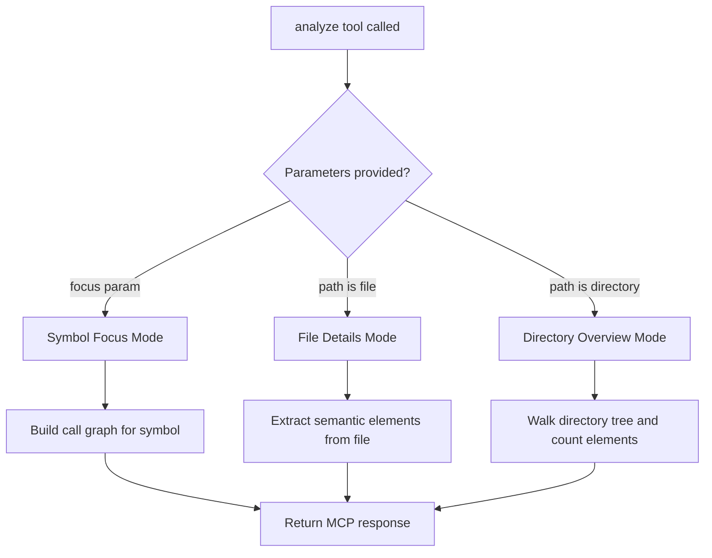

<div align="center">

# code-analyze-mcp

[](https://github.com/clouatre-labs/code-analyze-mcp/actions/workflows/ci.yml)
[](LICENSE)
[](https://www.rust-lang.org)
[](https://modelcontextprotocol.io)

Standalone MCP server for code structure analysis using tree-sitter.

</div>

## Overview

code-analyze-mcp is a Model Context Protocol server that analyzes code structure across 5 programming languages. It provides three analysis modes: directory overview (file tree with metrics), file-level semantic analysis (functions, classes, imports), and symbol-focused call graphs. It integrates with any MCP-compatible orchestrator (Claude Code, Kiro, Fast-Agent, MCP-Agent, and others), minimizing token usage while giving the LLM precise structural context.

## Installation

### Homebrew (macOS and Linux)

```bash
brew install clouatre-labs/tap/code-analyze-mcp
```

Update: `brew upgrade code-analyze-mcp`

### cargo-binstall (no Rust required)

```bash
cargo binstall code-analyze-mcp
```

### cargo install (requires Rust toolchain)

```bash
cargo install code-analyze-mcp
```

## Quick Start

### Build from source

```bash
cargo build --release
```

The binary is at `target/release/code-analyze-mcp`.

### Configure MCP Client

Add to `.mcp.json` at your project root (shared with your team via version control):

```json
{
  "mcpServers": {
    "code-analyze": {
      "command": "/path/to/code-analyze-mcp",
      "args": []
    }
  }
}
```

Or add via the Claude Code CLI:

```bash
claude mcp add code-analyze /path/to/code-analyze-mcp
```

## Tool Interface

The `analyze` tool accepts these parameters:

| Parameter | Type | Required | Default | Description |
|-----------|------|----------|---------|-------------|
| `path` | string | Yes | — | File or directory to analyze |
| `max_depth` | integer | No | unlimited | Directory recursion limit |
| `focus` | string | No | — | Symbol name for call graph analysis (case-sensitive) |
| `follow_depth` | integer | No | 1 | Call graph traversal depth |
| `ast_recursion_limit` | integer | No | 256 | Tree-sitter recursion limit for stack safety |
| `force` | boolean | No | false | Bypass output size warning |
| `mode` | string | No | auto | Analysis mode: 'overview', 'file_details', 'symbol_focus' |
| `summary` | boolean | No | auto | Compact output; unset=auto-detect when output exceeds 50K chars |
| `cursor` | string | No | — | Opaque pagination cursor token (from previous response's next_cursor) |
| `page_size` | integer | No | 100 | Number of items per page |

### Mode Auto-Detection



## Analysis Modes

### Directory Overview

Walks a directory tree, counts lines of code, functions, and classes per file. Respects `.gitignore` rules via the `ignore` crate.

**Triggered when:** Path is a directory and no `focus` parameter is provided.

**Example output:**

```
src/                                [328 LOC | F:28 C:5]
  main.rs                           [18 LOC | F:1 C:0]
  lib.rs                            [156 LOC | F:12 C:3]
  parser.rs                         [89 LOC | F:8 C:2]
  formatter.rs                      [65 LOC | F:7 C:0]
  languages/                        [142 LOC | F:19 C:5]
    mod.rs                          [45 LOC | F:5 C:2]
    rust.rs                         [97 LOC | F:14 C:3]

Total: 4 files, 328 LOC, 28 functions, 5 classes
```

**Usage:**

```bash
# Overview with default recursion
analyze path: /path/to/project

# Limit depth to 2 levels
analyze path: /path/to/project max_depth: 2

# Get summary totals only
analyze path: /path/to/project summary: true
```

### File Details

Extracts functions, classes, imports, and type references from a single file.

**Triggered when:** Path is a file and no `focus` parameter is provided.

**Example output:**

```
FILE: src/lib.rs [156 LOC | F:12 C:3]

CLASSES:
  CodeAnalyzer:20
  SemanticExtractor:45

FUNCTIONS:
  new:27
  analyze:35
  extract:52
  format_content:78
  build_index:89

IMPORTS:
  rmcp (3)
  serde (2)
  tree_sitter (4)
  thiserror (1)

REFERENCES:
  methods: [analyze, extract, format_content]
  types: [AnalysisResult, SemanticData, ParseError]
  fields: [path, mode, language]
```

**Usage:**

```bash
# File details
analyze path: /path/to/file.rs

# Get paginated results (100 items per page)
analyze path: /path/to/file.rs page_size: 50

# Fetch next page
analyze path: /path/to/file.rs cursor: eyJvZmZzZXQiOjUwfQ==
```

### Symbol Call Graph

Builds a call graph for a named symbol and traverses it with configurable depth. Uses sentinel values `<module>` (top-level calls) and `<reference>` (type references).

**Triggered when:** `focus` parameter is provided.

**Example output:**

```
FOCUS: analyze
DEPTH: 2
FILES: 12 analyzed

DEFINED:
  src/lib.rs:35

CALLERS (incoming):
  main -> analyze [src/main.rs:12]
  <module> -> analyze [src/lib.rs:40]
  process_request -> analyze [src/handler.rs:88]

CALLEES (outgoing):
  analyze -> determine_mode [src/analyze.rs:44]
  analyze -> format_output [src/formatter.rs:12] (•2)
  analyze -> validate_params [src/validation.rs:5]
  determine_mode -> is_directory [src/utils.rs:23]
```

Functions called >3 times show `(•N)` notation.

**Usage:**

```bash
# Call graph with default depth (1)
analyze path: /path/to/project focus: my_function

# Deeper traversal
analyze path: /path/to/project focus: my_function follow_depth: 3

# With directory limit
analyze path: /path/to/project focus: my_function max_depth: 3 follow_depth: 2
```

## Output Management

For large codebases, two mechanisms prevent context overflow:

**Pagination**

File details and symbol focus modes append a `NEXT_CURSOR:` line when output is truncated. Pass the token back as `cursor` to fetch the next page.

```
# Response ends with:
NEXT_CURSOR: eyJvZmZzZXQiOjUwfQ==

# Fetch next page:
analyze path: /my/project cursor: eyJvZmZzZXQiOjUwfQ== page_size: 100
```

**Summary Mode**

When output exceeds 50K chars, the server auto-compacts results using aggregate statistics. Override with `summary: true` (force) or `summary: false` (disable).

```bash
# Force summary for large project
analyze path: /huge/codebase summary: true

# Disable summary (get full details, may be large)
analyze path: /project summary: false
```

## Supported Languages

| Language | Extensions | Status |
|----------|-----------|--------|
| Rust | `.rs` | Implemented |
| Python | `.py` | Implemented |
| TypeScript | `.ts`, `.tsx` | Implemented |
| Go | `.go` | Implemented |
| Java | `.java` | Implemented |

## Documentation

- **[ARCHITECTURE.md](docs/ARCHITECTURE.md)** - Design goals, module map, data flow, language handler system, caching strategy
- **[CONTRIBUTING.md](CONTRIBUTING.md)** - Development workflow, commit conventions, PR checklist
- **[SECURITY.md](SECURITY.md)** - Security policy and vulnerability reporting

## License

Apache-2.0. See [LICENSE](LICENSE) for details.
