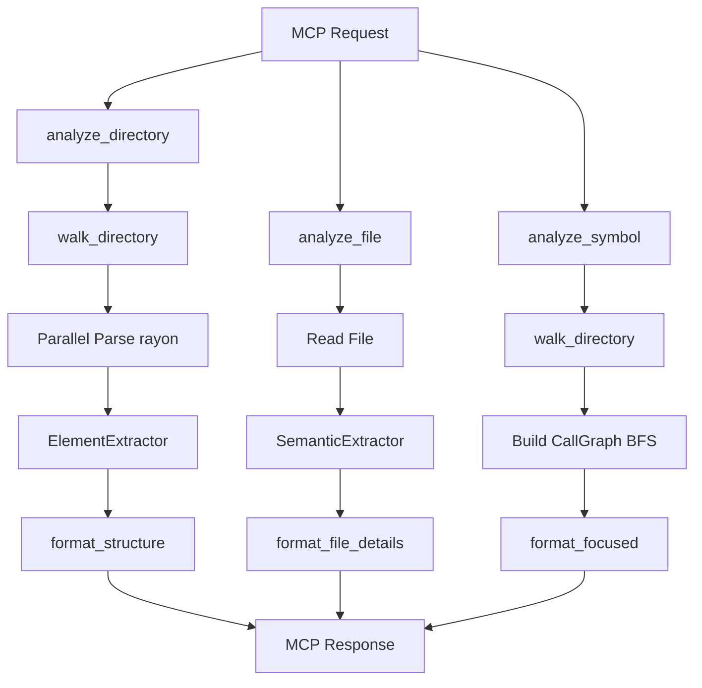

# Architecture

## Design Goals

- **Minimize token usage**: Return only structured, relevant context - no prose, no noise
- **Language-agnostic parsing via tree-sitter**: Support 5 languages with a unified query-based extraction system
- **Three focused MCP tools**: `analyze_directory`, `analyze_file`, and `analyze_symbol` -- each with a clear, explicit interface rather than a single tool with auto-detected modes
- **Compatible with any MCP orchestrator**: Claude Code, Kiro, Fast-Agent, MCP-Agent, and others
- **Performance via parallelism**: Use rayon for parallel file processing and ignore crate for efficient .gitignore-aware directory walking

## Module Map

| Module | File | Responsibility |
|--------|------|-----------------|
| `main` | `src/main.rs` | MCP server entry point; initializes tracing and stdio transport |
| `lib` | `src/lib.rs` | CodeAnalyzer struct; MCP tool handlers for `analyze_directory`, `analyze_file`, `analyze_symbol` |
| `analyze` | `src/analyze.rs` | High-level analysis orchestration; directory and file analysis |
| `parser` | `src/parser.rs` | Tree-sitter parsing; ElementExtractor and SemanticExtractor |
| `formatter` | `src/formatter.rs` | Output formatting for all three tools |
| `traversal` | `src/traversal.rs` | Directory walking with .gitignore support via ignore crate |
| `types` | `src/types.rs` | Shared data structures (AnalyzeParams, AnalysisResult, etc.) |
| `lang` | `src/lang.rs` | Extension-to-language mapping |
| `languages/mod` | `src/languages/mod.rs` | LanguageInfo registry and handler function types |
| `languages/rust` | `src/languages/rust.rs` | Rust-specific queries and semantic handlers |
| `cache` | `src/cache.rs` | LRU cache with mtime invalidation and lock_or_recover pattern |
| `graph` | `src/graph.rs` | CallGraph struct and BFS traversal for symbol focus mode |

## Data Flow

## Analysis Modes

### analyze_directory (Directory Overview)

1. Walk directory tree (respects .gitignore)
2. Filter to source files by extension
3. Parallel parse with rayon: extract function/class counts via ElementExtractor
4. Format as tree with LOC and counts per file

### analyze_file (File Details)

1. Detect language from extension
2. SemanticExtractor parses the file: functions with signatures, classes/structs with fields, imports, type references
3. Format as structured sections

### analyze_symbol (Symbol Call Graph)

1. Walk entire directory to build symbol index
2. Build CallGraph via BFS: callers (incoming) and callees (outgoing) to configurable depth
3. Sentinel values: `<module>` for top-level calls, `<reference>` for type references
4. Symbols called >3x marked with `•N`
5. Format as FOCUS/DEPTH/DEFINED/CALLERS/CALLEES sections

## Language Handler System

Each language is registered in `languages/mod.rs` as a `LanguageInfo` with tree-sitter queries and optional handler functions:

- `extract_function_name` -- resolve the name of a function node
- `find_method_for_receiver` -- resolve the method called on a receiver expression
- `find_receiver_type` -- resolve the type of a receiver

Adding a language requires: a tree-sitter grammar crate, a language module with `ELEMENT_QUERY` and `CALL_QUERY`, registration in `languages/mod.rs`, and extension mappings in `lang.rs`. See CONTRIBUTING.md for a step-by-step guide.

## Call Graph Design

BFS from the target symbol outward, tracking callers and callees at each depth level. Visited symbols are memoized to avoid cycles. Call frequency is counted across the walk; symbols exceeding the threshold are annotated in output. Sentinel values (`<module>`, `<reference>`) represent call sites that have no enclosing function or are type-level references rather than call expressions.
