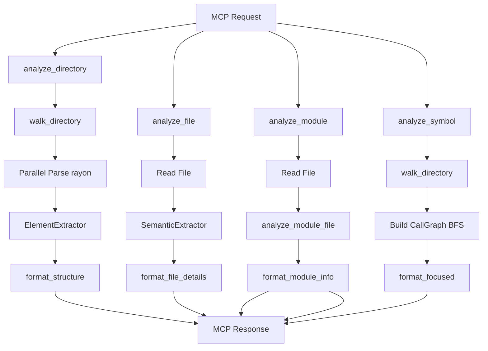

# Architecture

## See Also

- [MCP-BEST-PRACTICES.md](MCP-BEST-PRACTICES.md) - MCP tool design principles and annotation semantics that informed this server's interface design
- [ROADMAP.md](ROADMAP.md) - Wave history, benchmark-driven development process, small-model-first constraint. Planned features tracked there.
- [DESIGN-GUIDE.md](DESIGN-GUIDE.md) - Design decisions, rationale, and replication guide for building high-performance MCP servers

## Design Goals

- **Minimize token usage**: Return only structured, relevant context - no prose, no noise
- **Language-agnostic parsing via tree-sitter**: Support 11 languages (Rust, Go, Java, Python, TypeScript, TSX, Fortran, JavaScript, C, C++, C#) with a unified query-based extraction system; TypeScript and TSX use distinct grammars (`LANGUAGE_TYPESCRIPT` and `LANGUAGE_TSX`) but share the same queries in `crates/code-analyze-core/src/languages/typescript.rs`
- **Four focused MCP tools**: `analyze_directory`, `analyze_file`, `analyze_module`, and `analyze_symbol` -- each with a clear, explicit interface rather than a single tool with auto-detected modes
- **Compatible with any MCP orchestrator**: Designed to work with any standards-compliant MCP host
- **Performance via parallelism**: Use rayon for parallel file processing and ignore crate for efficient .gitignore-aware directory walking

For the reasoning behind these goals, see [DESIGN-GUIDE.md](DESIGN-GUIDE.md).

## Module Map

| Module | File | Responsibility |
|--------|------|-----------------|
| `main` | `src/main.rs` | MCP server entry point; initializes tracing and stdio transport |
| `lib` | `src/lib.rs` | CodeAnalyzer struct; MCP tool handlers for `analyze_directory`, `analyze_file`, `analyze_module`, `analyze_symbol` |
| `analyze` | `src/analyze.rs` | High-level analysis orchestration; directory, file, and module analysis |
| `parser` | `src/parser.rs` | Tree-sitter parsing; ElementExtractor and SemanticExtractor |
| `formatter` | `src/formatter.rs` | Output formatting for all four tools |
| `traversal` | `src/traversal.rs` | Directory walking with .gitignore support via ignore crate |
| `types` | `src/types.rs` | Shared data structures (`AnalyzeDirectoryParams`, `AnalyzeFileParams`, `AnalyzeModuleParams`, `AnalyzeSymbolParams`, `AnalysisResult`, etc.) |
| `lang` | `src/lang.rs` | Extension-to-language mapping |
| `languages/mod` | `src/languages/mod.rs` | LanguageInfo registry and handler function types |
| `languages/rust` | `src/languages/rust.rs` | Rust-specific queries and semantic handlers |
| `cache` | `src/cache.rs` | LRU cache with mtime invalidation and lock_or_recover pattern |
| `completion` | `src/completion.rs` | Path completion support respecting .gitignore |
| `logging` | `src/logging.rs` | MCP logging integration via tracing; McpLoggingLayer bridges events to MCP clients |
| `schema_helpers` | `src/schema_helpers.rs` | JSON Schema helpers for integer and page_size field validation |
| `test_detection` | `src/test_detection.rs` | Test file detection by path heuristics (directory and filename patterns) |
| `pagination` | `src/pagination.rs` | Cursor-based pagination with CursorData and PaginationMode (Default, Callers, Callees) |
| `graph` | `src/graph.rs` | CallGraph struct and BFS traversal for symbol focus mode |
| `metrics` | `src/metrics.rs` | Metrics collection and daily-rotating JSONL emission; `MetricEvent`, `MetricsSender`, `MetricsWriter` |

## Data Flow

## Analysis Modes

### analyze_directory (Directory Overview)

1. Walk directory tree (respects .gitignore)
2. Filter to source files by extension
3. Parallel parse with rayon: extract function/class counts via ElementExtractor
4. Format as tree with LOC and counts per file

### analyze_file (File Details)

1. Detect language from extension
2. SemanticExtractor parses the file: functions with signatures, classes/structs with fields, imports, type references
3. Format as structured sections

### analyze_module (Module Index)

1. Detect language from extension
2. `analyze_module_file` in `src/analyze.rs` reads the file and dispatches to `SemanticExtractor`
3. Returns a minimal fixed schema: `name`, `line_count`, `language`, `functions[{name, line}]`, `imports[{module, items}]`
4. No call graph, no type references, no field accesses -- output is ~75% smaller than `analyze_file`

### analyze_symbol (Symbol Call Graph)

1. Walk entire directory to build symbol index
2. Build CallGraph via BFS: callers (incoming) and callees (outgoing) to configurable depth
3. Sentinel values: `<module>` for top-level calls, `<reference>` for type references
4. Symbols called >3x marked with `•N`
5. Format as FOCUS/DEPTH/DEFINED/CALLERS/CALLEES sections

## Language Handler System

Each language is registered in `languages/mod.rs` as a `LanguageInfo` with tree-sitter queries and optional handler functions:

- Mandatory queries: `element_query`, `call_query`
- Optional queries: `reference_query`, `import_query`, `impl_query`, `impl_trait_query`
- Handler functions: `extract_function_name`, `find_method_for_receiver`, `find_receiver_type`, `extract_inheritance` (optional)

Adding a language requires: a tree-sitter grammar crate, a language module with `ELEMENT_QUERY` and `CALL_QUERY`, registration in `languages/mod.rs`, and extension mappings in `lang.rs`. See CONTRIBUTING.md for a step-by-step guide.

JavaScript is the only language registered with `reference_query: None`. JavaScript's dynamic typing makes static type reference extraction low-value: identifiers appear in many non-type contexts, producing excessive false positives with no meaningful signal. All other supported languages provide a `REFERENCE_QUERY`.

## Call Graph Design

BFS from the target symbol outward, tracking callers and callees at each depth level. Visited symbols are memoized to avoid cycles. Call frequency is counted across the walk; symbols exceeding the threshold are annotated in output. Sentinel values (`<module>`, `<reference>`) represent call sites that have no enclosing function or are type-level references rather than call expressions.

Symbol resolution uses SymbolMatchMode to locate the target symbol: Exact (case-sensitive, default), Insensitive (case-insensitive exact), Prefix (case-insensitive prefix match), and Contains (case-insensitive substring match). When multiple candidates match, resolve_symbol() returns an error listing candidates; clients must refine the query or use a stricter match_mode.

## AnalysisConfig

`AnalysisConfig` provides resource limits for library consumers (exported from `code_analyze_core`):

- `max_file_bytes`: Skip files exceeding this size in bytes during analysis. `None` = no limit.
- `parse_timeout_micros`: Reserved for future parse timeout enforcement. `None` = no timeout (no-op in current version).
- `cache_capacity`: Override the default LRU cache capacity. `None` = use default.

Use `AnalysisConfig::default()` for standard behavior with no limits applied.
