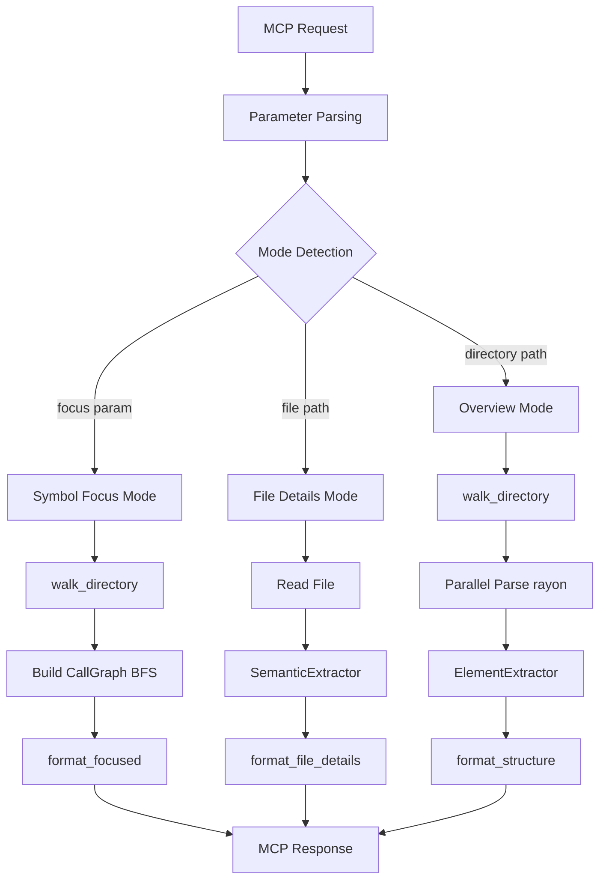

# Architecture

## Design Goals

- **Goose analyze parity in standalone binary**: Replicate goose's code analysis capabilities as a standalone MCP server, enabling integration with any MCP client
- **Language-agnostic parsing via tree-sitter**: Support 5 languages with a unified query-based extraction system, avoiding language-specific parsers
- **Single MCP tool with auto-detected modes**: One `analyze` tool that automatically detects analysis mode (overview, file details, symbol focus) based on input parameters
- **Performance via parallelism**: Use rayon for parallel file processing and ignore crate for efficient .gitignore-aware directory walking

## Module Map

| Module | File | Responsibility |
|--------|------|-----------------|
| `main` | `src/main.rs` | MCP server entry point; initializes tracing and stdio transport |
| `lib` | `src/lib.rs` | CodeAnalyzer struct; MCP tool handler; mode dispatch |
| `analyze` | `src/analyze.rs` | High-level analysis orchestration; directory and file analysis |
| `parser` | `src/parser.rs` | Tree-sitter parsing; ElementExtractor and SemanticExtractor |
| `formatter` | `src/formatter.rs` | Output formatting for all three modes |
| `traversal` | `src/traversal.rs` | Directory walking with .gitignore support via ignore crate |
| `types` | `src/types.rs` | Shared data structures (AnalyzeParams, AnalysisResult, etc.) |
| `lang` | `src/lang.rs` | Extension-to-language mapping |
| `languages/mod` | `src/languages/mod.rs` | LanguageInfo registry and handler function types |
| `languages/rust` | `src/languages/rust.rs` | Rust-specific queries and semantic handlers |
| `cache` | `src/cache.rs` | LRU cache with mtime invalidation and lock_or_recover pattern |
| `graph` | `src/graph.rs` | CallGraph struct and BFS traversal for symbol focus mode |

## Data Flow



## Analysis Modes

### Structure Mode (Directory Overview)

Triggered when path is a directory and no focus parameter is provided.

**Pipeline:**
1. Walk directory tree with `walk_directory()` (respects .gitignore)
2. Filter to source files (by extension)
3. Parallel parse with rayon: for each file, read source and extract function/class counts
4. ElementExtractor uses tree-sitter queries to count elements
5. Format as tree with LOC and counts per file
6. Return FileInfo vector for JSON output

**Key Functions:**
- `analyze_directory()` - orchestrates the pipeline
- `walk_directory()` - uses ignore crate for .gitignore-aware traversal
- `ElementExtractor::extract_with_depth()` - counts functions and classes

### Semantic Mode (File Details)

Triggered when path is a file and no focus parameter is provided.

**Pipeline:**
1. Read file source
2. Detect language from extension
3. SemanticExtractor parses the file:
   - Extract functions with parameters and return types
   - Extract classes/structs with methods and fields
   - Extract imports with full module paths
   - Extract type references (method receivers, field types, parameters)
4. Populate reference locations (file path, line number)
5. Format as structured text with sections for classes, functions, imports, references
6. Return SemanticAnalysis struct for JSON output

**Key Functions:**
- `analyze_file()` - orchestrates file-level analysis
- `SemanticExtractor::extract()` - parses file and extracts semantic elements
- `format_file_details()` - formats output with sections

### Focused Mode (Symbol Call Graph)

Triggered when focus parameter is provided.

**Pipeline:**
1. Walk entire directory to build symbol index
2. Locate symbol definition (file, line)
3. Build CallGraph via BFS:
   - Find all callers of the symbol (incoming edges)
   - Find all callees of the symbol (outgoing edges)
   - Traverse to configurable depth (follow_depth)
   - Track call frequency (functions called >3x marked with •N)
4. Use sentinel values:
   - `<module>` for top-level calls without a caller function
   - `<reference>` for type references (instantiation, field types)
5. Format as FOCUS/DEPTH/DEFINED/CALLERS/CALLEES sections
6. Return FocusedAnalysisData struct for JSON output

**Key Functions:**
- `build_call_graph()` - constructs graph from directory
- `CallGraph::bfs_traverse()` - traverses graph with depth limit
- `format_focused()` - formats call graph output

## Language Handler System

Each language is represented by a `LanguageInfo` struct containing:

```rust
pub struct LanguageInfo {
    pub name: &'static str,                              // "rust", "python", etc.
    pub language: Language,                              // tree-sitter Language
    pub element_query: &'static str,                     // Query to count functions/classes
    pub call_query: &'static str,                        // Query to find function calls
    pub reference_query: Option<&'static str>,           // Query to find type references
    pub extract_function_name: Option<ExtractFunctionNameHandler>,
    pub find_method_for_receiver: Option<FindMethodForReceiverHandler>,
    pub find_receiver_type: Option<FindReceiverTypeHandler>,
}
```

Handler function types:

```rust
pub type ExtractFunctionNameHandler = fn(&Node, &str, &str) -> Option<String>;
pub type FindMethodForReceiverHandler = fn(&Node, &str, Option<usize>) -> Option<String>;
pub type FindReceiverTypeHandler = fn(&Node, &str) -> Option<String>;
```

### How to Add a New Language

1. **Add tree-sitter grammar crate to Cargo.toml:**
   ```toml
   tree-sitter-kotlin = "0.23.0"
   ```

2. **Create language module** (e.g., `src/languages/kotlin.rs`):
   ```rust
   pub const ELEMENT_QUERY: &str = r#"
     (function_declaration) @function
     (class_declaration) @class
   "#;
   
   pub const CALL_QUERY: &str = r#"
     (call_expression function: (identifier) @callee)
   "#;
   
   pub fn extract_function_name(node: &Node, source: &str, _lang: &str) -> Option<String> {
       // Extract function name from node
   }
   ```

3. **Register in `languages/mod.rs`:**
   ```rust
   "kotlin" => Some(LanguageInfo {
       name: "kotlin",
       language: tree_sitter_kotlin::LANGUAGE.into(),
       element_query: kotlin::ELEMENT_QUERY,
       call_query: kotlin::CALL_QUERY,
       reference_query: None,
       extract_function_name: Some(kotlin::extract_function_name),
       find_method_for_receiver: None,
       find_receiver_type: None,
   }),
   ```

4. **Add extension mapping in `lang.rs`:**
   ```rust
   ("kt", "kotlin"),
   ("kts", "kotlin"),
   ```

5. **Write tests** in `src/languages/kotlin.rs`:
   - Happy path: extract functions and classes from valid code
   - Edge case: handle empty files, syntax errors, or language-specific constructs

## Call Graph Design

The CallGraph struct represents function call relationships:

```rust
pub struct CallGraph {
    pub callers: HashMap<String, Vec<CallInfo>>,    // symbol -> [callers]
    pub callees: HashMap<String, Vec<CallInfo>>,    // symbol -> [callees]
    pub definitions: HashMap<String, DefinitionInfo>, // symbol -> location
    pub call_frequency: HashMap<String, usize>,     // symbol -> call count
}
```

**BFS Traversal Algorithm:**
1. Start at symbol definition
2. Queue: [(symbol, depth=0)]
3. For each item in queue:
   - If depth < follow_depth:
     - Add all callers to queue with depth+1
     - Add all callees to queue with depth+1
   - Track visited symbols to avoid cycles
4. Return graph with all reachable symbols

**Sentinel Values:**
- `<module>`: Top-level calls (no caller function context)
- `<reference>`: Type references (field types, parameter types, instantiation)

**Call Frequency:**
- Count how many times each symbol is called
- Mark symbols called >3 times with `(•N)` in output

## Caching Strategy

Uses LRU cache with mtime-based invalidation.

**Cache Key:** `(path, mtime, mode)`

**Cache Entry:**
```rust
pub struct CacheEntry {
    pub result: AnalysisResult,
    pub mtime: SystemTime,
    pub created_at: SystemTime,
}
```

**Invalidation:**
- Check file mtime on cache hit
- If mtime changed, invalidate and reparse
- For directories, check mtime of all files in tree

**Lock-or-Recover Pattern:**
- If parsing fails, return last valid cached result
- Log warning but don't fail the request
- Allows graceful degradation if a file becomes temporarily unreadable

**Configuration:**
- Max cache size: 1000 entries (configurable)
- TTL: 1 hour (optional, for safety)

## MCP Protocol (Planned)

Issues #42, #43, and #44 will bring the server to full MCP 2025-06-18 compliance.

**Protocol Version and Capabilities (#42):**
- Bump from `V_2024_11_05` to `V_2025_06_18` (rmcp `ProtocolVersion::LATEST`)
- Declare `tools` capability via `ServerCapabilities::builder().enable_tools()`
- Add `read_only_hint = true` annotation to the analyze tool
- Use `Json<T>` wrapper for structured output with `output_schema` and `structured_content`

**Progress Notifications (#43):**
- Store the MCP peer handle on `CodeAnalyzer` for bidirectional communication
- Emit `notifications/progress` during directory walks (per-file or batched)
- Throttle to avoid overwhelming clients on large codebases

**Logging Notifications (#44):**
- Custom `tracing::Layer` that forwards log events as `notifications/message`
- Maps tracing levels to MCP log levels (DEBUG, INFO, WARN, ERROR)
- Requires `logging` capability declaration in `ServerCapabilities`

## Error Handling

Three error types using thiserror:

```rust
#[derive(Debug, Error)]
pub enum ParserError {
    #[error("Unsupported language: {0}")]
    UnsupportedLanguage(String),
    #[error("Failed to parse file: {0}")]
    ParseError(String),
    #[error("Invalid UTF-8 in file")]
    InvalidUtf8,
    #[error("Query error: {0}")]
    QueryError(String),
}

#[derive(Debug, Error)]
pub enum TraversalError {
    #[error("IO error: {0}")]
    Io(#[from] std::io::Error),
    #[error("Invalid path: {0}")]
    InvalidPath(String),
}

#[derive(Debug, Error)]
pub enum AnalyzeError {
    #[error("Traversal error: {0}")]
    Traversal(#[from] TraversalError),
    #[error("Parser error: {0}")]
    Parser(#[from] ParserError),
}
```

**Error Propagation:**
- Use `?` operator in all functions
- No `unwrap()` or `expect()` in library code
- MCP tool handler converts errors to ErrorData with descriptive messages

## Performance

**Parallel Processing:**
- rayon for parallel file parsing in structure mode
- Each file parsed independently; no shared state
- Scales to 100+ files efficiently

**Directory Walking:**
- ignore crate respects .gitignore and .gooseignore
- Avoids traversing excluded directories (e.g., node_modules, .git)
- Reduces I/O by 50-80% on typical projects

**AST Recursion Limit:**
- Prevents stack overflow on deeply nested code
- Configurable via ast_recursion_limit parameter
- Default: 256 (safe for most code)

**Output Size Limiting:**
- Warn if output exceeds 1000 lines
- force flag bypasses warning
- Prevents MCP client from being overwhelmed

## Improvements Over Goose

- **Proper TypeScript support**: Uses tree-sitter-typescript, not JavaScript fallback
- **JSX and TSX**: Dedicated file mappings and queries
- **Language-specific handlers**: extract_function_name, find_method_for_receiver, find_receiver_type for semantic accuracy
- **Call graph with sentinel values**: `<module>` and `<reference>` for cross-file analysis
- **Parallel file processing**: rayon for faster analysis on large codebases
- **Nested .gitignore support**: ignore crate respects directory-specific ignore rules
- **Standalone binary**: Not integrated into goose; can be used with any MCP client

## Current Status

The project is approximately 90% complete:

- **Complete (Waves 0-4a):**
  - Project skeleton (main.rs, lib.rs, types.rs, lang.rs)
  - CI pipeline (format, lint, commitlint, check-base)
  - Structure mode (directory overview with file tree)
  - Semantic mode (file-level analysis with functions, classes, imports)
  - Symbol focus mode (call graphs with BFS traversal)
  - All 5 language modules (Rust, Python, TypeScript, Go, Java)
  - LRU caching with mtime invalidation
  - Output size limiting and force flag

- **Planned (Waves 4b-4c):**
  - MCP protocol compliance: version bump, capabilities, annotations, structured output (#42)
  - MCP progress notifications during directory analysis (#43)
  - MCP logging notifications: tracing-to-client bridge (#44)
  - Performance testing and tuning (#7)

See [issue #1](https://github.com/clouatre-labs/code-analyze-mcp/issues/1) for the complete roadmap and wave-based merge plan.
