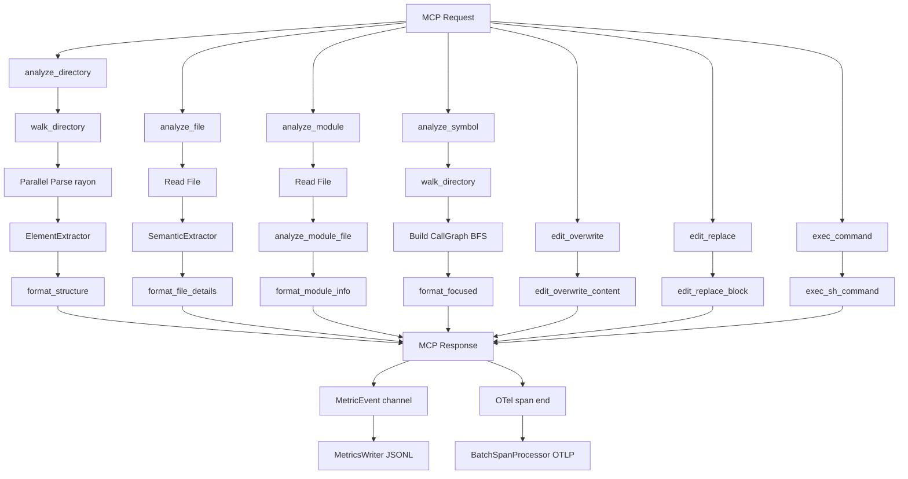

# Architecture

## See Also

- [MCP-BEST-PRACTICES.md](MCP-BEST-PRACTICES.md) - MCP tool design principles and annotation semantics that informed this server's interface design
- [ROADMAP.md](ROADMAP.md) - Wave history, benchmark-driven development process, small-model-first constraint. Planned features tracked there.
- [DESIGN-GUIDE.md](DESIGN-GUIDE.md) - Design decisions, rationale, and replication guide for building high-performance MCP servers

## Design Goals

- **Minimize token usage**: Return only structured, relevant context - no prose, no noise
- **Language-agnostic parsing via tree-sitter**: Support 12 languages (Rust, Go, Java, Kotlin, Python, TypeScript, TSX, Fortran, JavaScript, C, C++, C#) with a unified query-based extraction system; TypeScript and TSX use distinct grammars (`LANGUAGE_TYPESCRIPT` and `LANGUAGE_TSX`) but share the same queries in `crates/aptu-coder-core/src/languages/typescript.rs`
- **Seven focused MCP tools**: `analyze_directory`, `analyze_file`, `analyze_module`, `analyze_symbol` (analyze_* family); `edit_overwrite`, `edit_replace` (edit_* family); `exec_command` (exec_* family) -- each with a clear, explicit interface rather than a single tool with auto-detected modes
- **Compatible with any MCP orchestrator**: Designed to work with any standards-compliant MCP host
- **Performance via parallelism**: Use rayon for parallel file processing and ignore crate for efficient .gitignore-aware directory walking

For the reasoning behind these goals, see [DESIGN-GUIDE.md](DESIGN-GUIDE.md).

## Module Map

| Module | File | Responsibility |
|--------|------|-----------------|
| `main` | `crates/aptu-coder/src/main.rs` | MCP server entry point; initializes tracing, OTel providers, metrics channel, and stdio transport |
| `lib` | `crates/aptu-coder/src/lib.rs` | CodeAnalyzer struct; MCP tool handlers for `analyze_directory`, `analyze_file`, `analyze_module`, `analyze_symbol`, `edit_overwrite`, `edit_replace`, `exec_command` |
| `logging` | `crates/aptu-coder/src/logging.rs` | MCP logging integration via tracing; McpLoggingLayer bridges events to MCP clients via `notifications/message` |
| `otel` | `crates/aptu-coder/src/otel.rs` | OpenTelemetry provider initialization; `init_otel` (traces), `init_log_appender` (logs), `init_meter` (metrics); all gated on `OTEL_EXPORTER_OTLP_ENDPOINT`; noop when unset |
| `schema_helpers` | `crates/aptu-coder-core/src/schema_helpers.rs` | Core JSON Schema helpers for integer and page_size field validation |
| `metrics` | `crates/aptu-coder/src/metrics.rs` | Always-on JSONL metrics: daily-rotating files, `MetricEvent`, `MetricsSender`, `MetricsWriter`; includes `migrate_legacy_metrics_dir` for the `code-analyze-mcp` → `aptu-coder` XDG path migration |
| `analyze` | `crates/aptu-coder-core/src/analyze.rs` | High-level analysis orchestration; directory, file, and module analysis |
| `analyze_str` | `crates/aptu-coder-core/src/analyze.rs` | Public in-memory API; parses source text without filesystem access; `AnalyzeError::UnsupportedLanguage` variant |
| `parser` | `crates/aptu-coder-core/src/parser.rs` | Tree-sitter parsing; ElementExtractor and SemanticExtractor |
| `formatter` | `crates/aptu-coder-core/src/formatter.rs` | Output formatting for all seven tools |
| `traversal` | `crates/aptu-coder-core/src/traversal.rs` | Directory walking with .gitignore support via ignore crate |
| `types` | `crates/aptu-coder-core/src/types.rs` | Shared data structures (`AnalyzeDirectoryParams`, `AnalyzeFileParams`, `AnalyzeModuleParams`, `AnalyzeSymbolParams`, `AnalysisResult`, etc.) |
| `lang` | `crates/aptu-coder-core/src/lang.rs` | Extension-to-language mapping |
| `languages/mod` | `crates/aptu-coder-core/src/languages/mod.rs` | LanguageInfo registry and handler function types |
| `languages/rust` | `crates/aptu-coder-core/src/languages/rust.rs` | Rust-specific queries and semantic handlers |
| `languages/kotlin` | `crates/aptu-coder-core/src/languages/kotlin.rs` | Kotlin-specific queries and semantic handlers; supports `.kt` and `.kts` extensions |
| `languages/fortran` | `crates/aptu-coder-core/src/languages/fortran.rs` | Fortran-specific queries and semantic handlers; supports module extraction, subroutine/function name extraction, Fortran 2003+ OOP bound procedure calls (`obj%method()`); registers `extract_function_name`, `find_receiver_type`, and `find_method_for_receiver` |
| `cache` | `crates/aptu-coder-core/src/cache.rs` | LRU cache with mtime invalidation and lock_or_recover pattern |
| `completion` | `crates/aptu-coder-core/src/completion.rs` | Path completion support respecting .gitignore |
| `test_detection` | `crates/aptu-coder-core/src/test_detection.rs` | Test file detection by path heuristics (directory and filename patterns) |
| `pagination` | `crates/aptu-coder-core/src/pagination.rs` | Cursor-based pagination with CursorData and PaginationMode (Default, Callers, Callees) |
| `graph` | `crates/aptu-coder-core/src/graph.rs` | CallGraph struct and BFS traversal for symbol focus mode |

## Data Flow

## Analysis Modes

### analyze_directory (Directory Overview)

1. Walk directory tree (respects .gitignore)
2. Filter to source files by extension
3. Parallel parse with rayon: extract function/class counts via ElementExtractor
4. Format as tree with LOC and counts per file

When `git_ref` is set, `changed_files_from_git_ref()` runs `git diff` to get the set of changed files; `filter_entries_by_git_ref()` then post-filters the already-walked entries to those files before formatting begins.

### analyze_file (File Details)

1. Detect language from extension
2. SemanticExtractor parses the file: functions with signatures, classes/structs with fields, imports, type references
3. Format as structured sections

### analyze_module (Module Index)

1. Detect language from extension
2. `analyze_module_file` in `src/analyze.rs` reads the file and dispatches to `SemanticExtractor`
3. Returns a minimal fixed schema: `name`, `line_count`, `language`, `functions[{name, line}]`, `imports[{module, items}]`
4. No call graph, no type references, no field accesses -- output is ~75% smaller than `analyze_file`

### analyze_str (In-Memory Parsing)

1. Accept `source: &str`, `language: &str`, and `ast_recursion_limit: Option<usize>` -- no filesystem I/O
2. Resolve language string to a `LanguageInfo` entry; return `Err(AnalyzeError::UnsupportedLanguage(language.to_string()))` if not found
3. Run `SemanticExtractor` on the source bytes directly
4. Return `Ok(FileAnalysisOutput)` on success

Exported from `aptu_coder_core` as a public API for library consumers that hold source text in memory (e.g. language servers, test harnesses) without a corresponding on-disk path. Eliminates the TOCTOU race and I/O overhead of writing a temp file first.

### analyze_symbol (Symbol Call Graph)

1. Walk entire directory to build symbol index
2. Build CallGraph via BFS: callers (incoming) and callees (outgoing) to configurable depth
3. Sentinel values: `<module>` for top-level calls, `<reference>` for type references
4. Symbols called >3x marked with `•N`
5. Format as FOCUS/DEPTH/DEFINED/CALLERS/CALLEES sections

**Structured output:** In addition to formatted text, `analyze_symbol` populates three fields on `FocusedAnalysisOutput` for programmatic consumption:
- `callers: Option<Vec<CallChainEntry>>` -- depth-1 production callers
- `test_callers: Option<Vec<CallChainEntry>>` -- depth-1 callers from test files
- `callees: Option<Vec<CallChainEntry>>` -- depth-1 callees

`CallChainEntry` is a stable public type (exported from `aptu_coder_core`) with fields `symbol: String`, `file: String`, `line: usize`. Conversion from the internal `InternalCallChain` (which is non-serializable and stays internal) happens at the output boundary via the private `chains_to_entries` helper. The `follow_depth` parameter does not affect these arrays; they always represent depth-1 relationships.

**Import lookup mode:** When `import_lookup=true`, instead of building a call graph, the tool scans all files in the directory for imports of the module path specified in `symbol`. Returns a list of files that import that module. Mutually exclusive with the call-graph mode.

**Git ref filtering:** When `git_ref` is set, `changed_files_from_git_ref()` runs `git diff` to get the set of changed files, and `filter_entries_by_git_ref()` restricts the analysis to those files before the graph is built.

**Def-use mode:** When `def_use=true`, the tool computes definition and use sites alongside the call graph. However, `def_use_sites` is cleared (`Vec::new()`) in `structuredContent` on the initial response. Once the callers and callees pages are exhausted, the handler automatically emits a `{mode: defuse, offset: 0}` cursor. Following that cursor enters `PaginationMode::DefUse`, where `def_use_sites` is populated as `Vec<DefUseSite>` and sliced per page. Each `DefUseSite` has: `kind` (write/read/write_read), `symbol`, `file`, `line`, `column`, `snippet`, `enclosing_scope`.

## Observability Architecture

### Dual-stream model

Two independent telemetry channels run in parallel; neither blocks tool execution.

**JSONL metrics (always-on):** Every tool handler fires a `MetricEvent` into an unbounded Tokio channel at return. `MetricsWriter` drains the channel in a background task and appends to a daily-rotated JSONL file at `$XDG_DATA_HOME/aptu-coder/metrics/`. File retention is 30 days. `migrate_legacy_metrics_dir()` runs on startup to rename the old `code-analyze-mcp` directory to `aptu-coder` if the new path does not yet exist.

**OpenTelemetry (opt-in):** When `OTEL_EXPORTER_OTLP_ENDPOINT` is set, `otel.rs` initializes three providers (trace, log, meter) via OTLP/HTTP with `BatchSpanProcessor` / `PeriodicReader` export. The `tracing-opentelemetry` bridge wires `#[instrument]` spans into the OTel trace provider. `opentelemetry-appender-tracing` forwards log events as OTel `LogRecord`s, injecting `trace_id` and `span_id`. When the env var is unset, noop providers are used with zero runtime overhead; noop span creation costs ~6.6 µs.

### W3C Trace Context propagation

The server extracts `traceparent` and `tracestate` from `MCP params._meta` on every tool call and sets them as the span parent context. Tool spans appear as children of the calling agent's distributed trace (goose session, Claude turn). This requires no changes to tool handlers -- context extraction is done at the handler dispatch layer in `lib.rs`.

### Child spans for sub-operations

Key sub-operations are wrapped in named child spans so P95 breakdowns are visible per-operation from real traffic:

| Span name | Location | Sub-operation |
|---|---|---|
| `ast.parse_batch` | `analyze.rs` | Rayon parallel parse batch for `analyze_directory` |
| `graph.traverse` | `graph.rs` | BFS traversal per depth level in `analyze_symbol` |
| `walk_directory` | `traversal.rs` | .gitignore-aware directory walk |

### Span attribute policy

All tool handlers record bounded, safe-to-emit span attributes (tool name, path, symbol, result status, error category). Secrets, file content, command output, and stdin are in the never-record list. See [OBSERVABILITY.md](../OBSERVABILITY.md) at the repository root for the full policy and PR review checklist.

## Language Handler System

Each language is registered in `languages/mod.rs` as a `LanguageInfo` with tree-sitter queries and optional handler functions:

- Mandatory queries: `element_query`, `call_query`
- Optional queries: `reference_query`, `import_query`, `impl_query`, `impl_trait_query`
- Handler functions: `extract_function_name`, `find_method_for_receiver`, `find_receiver_type`, `extract_inheritance` (optional)

Adding a language requires: a tree-sitter grammar crate, a language module with `ELEMENT_QUERY` and `CALL_QUERY`, registration in `languages/mod.rs`, and extension mappings in `lang.rs`. See CONTRIBUTING.md for a step-by-step guide.

JavaScript is the only language registered with `reference_query: None`. JavaScript's dynamic typing makes static type reference extraction low-value: identifiers appear in many non-type contexts, producing excessive false positives with no meaningful signal. All other supported languages provide a `REFERENCE_QUERY`.

## Call Graph Design

BFS from the target symbol outward, tracking callers and callees at each depth level. Visited symbols are memoized to avoid cycles. Call frequency is counted across the walk; symbols exceeding the threshold are annotated in output. Sentinel values (`<module>`, `<reference>`) represent call sites that have no enclosing function or are type-level references rather than call expressions.

Symbol resolution uses SymbolMatchMode to locate the target symbol: Exact (case-sensitive, default), Insensitive (case-insensitive exact), Prefix (case-insensitive prefix match), and Contains (case-insensitive substring match). When multiple candidates match, resolve_symbol() returns an error listing candidates; clients must refine the query or use a stricter match_mode.

## AnalysisConfig

`AnalysisConfig` provides resource limits for library consumers (exported from `aptu_coder_core`):

- `max_file_bytes`: Skip files exceeding this size in bytes during analysis. `None` = no limit.
- `parse_timeout_micros`: Reserved for future parse timeout enforcement. `None` = no timeout (no-op in current version).
- `cache_capacity`: Override the default LRU cache capacity. `None` = use default.

Use `AnalysisConfig::default()` for standard behavior with no limits applied.
