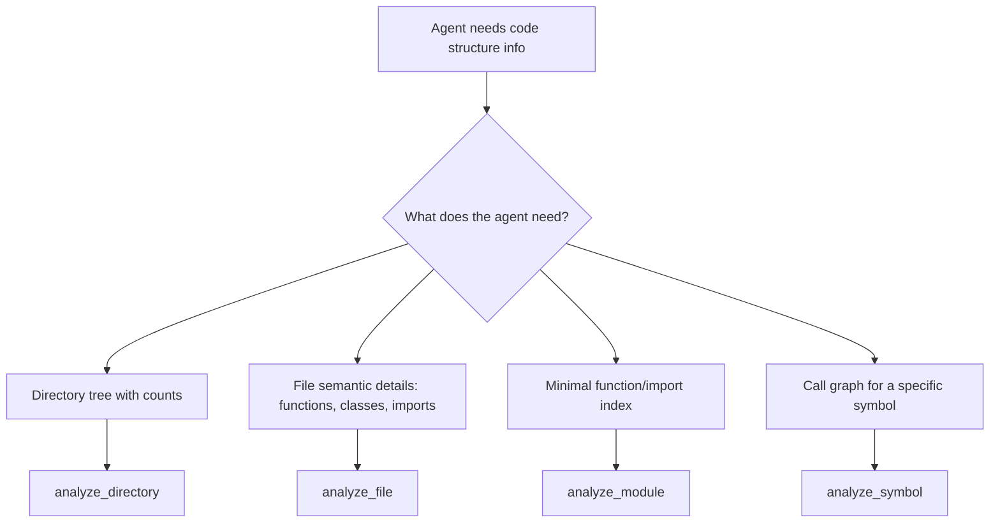
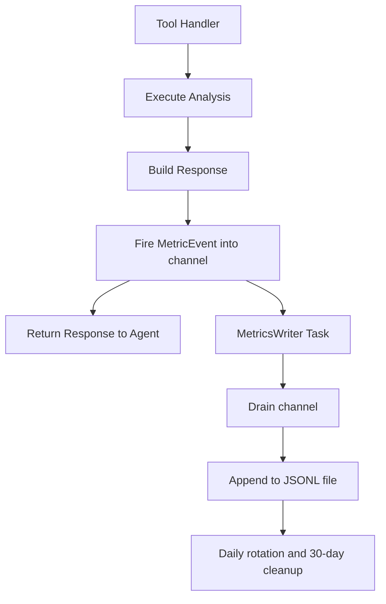

# Design Guide

## See Also

- [ARCHITECTURE.md](ARCHITECTURE.md) - module map and data flow
- [MCP-BEST-PRACTICES.md](MCP-BEST-PRACTICES.md) - MCP tool design principles and annotation semantics
- [OBSERVABILITY.md](OBSERVABILITY.md) - metrics schema and channel pattern implementation
- [ROADMAP.md](ROADMAP.md) - wave history, benchmark results, and small-model-first constraint

## 1. Purpose and Scope

**Target audience:** An engineer building a new MCP server or forking this one.

**How to read this document:** Principles are normative. Examples are illustrative; they show how the principle was applied in this server but the specific technology is replaceable. Each example is labeled *Example:* or indented below the principle.

See [ARCHITECTURE.md](ARCHITECTURE.md) for the module map, [MCP-BEST-PRACTICES.md](MCP-BEST-PRACTICES.md) for MCP protocol background, and [ROADMAP.md](ROADMAP.md) for benchmark history.

## 2. Tool Architecture Decisions

### Why Nine Tools Instead of One

**Principle:** Each tool does one thing well. Non-overlapping interfaces eliminate ambiguous routing. When two tools can satisfy the same request, the model must guess; that is a reliability failure, not a model failure. (See [MCP-BEST-PRACTICES.md](MCP-BEST-PRACTICES.md), section 3.2.)

*Example: This server has nine tools — `analyze_directory`, `analyze_file`, `analyze_module`, `analyze_symbol`, `analyze_raw` (analysis family); `edit_overwrite`, `edit_replace`, `edit_rename`, `edit_insert` (editing family) — each with a distinct, non-overlapping responsibility. A single auto-detecting tool was rejected because it required the model to infer the correct mode from context, which failed under small models.*



*Figure 1: Agent tool-selection flow: each decision branch maps to exactly one tool.*

| Tool | Purpose | Intentionally Excludes |
|---|---|---|
| `analyze_directory` | Directory tree with LOC, function count, class count | Function signatures, call graphs, imports |
| `analyze_file` | Functions with signatures, classes, imports, type references | Call graph traversal, directory walking |
| `analyze_module` | Minimal function/import index (~75% smaller than `analyze_file`) | Signatures, types, class details, call graphs |
| `analyze_symbol` | Call graph for a named function/method across a directory | File-level details, directory counts |
| `analyze_raw` | Raw file content with optional line range | AST parsing, structure extraction |
| `edit_overwrite` | Create or overwrite a file | AST awareness, incremental updates |
| `edit_replace` | Replace exact text block in a file | AST awareness, directory-wide changes |
| `edit_rename` | AST-aware rename within a single file | Directory-wide rename, type-aware refactoring |
| `edit_insert` | Insert content before/after a named identifier | Directory-wide insertion, AST-unaware insertion |

*Table 1: The nine tools, their purpose, and what each intentionally excludes.*

### Single Responsibility Trade-off

Splitting into nine tools adds surface area (nine tool descriptions to maintain, nine output schemas). The benefit is deterministic routing: an agent that asks about a symbol never accidentally triggers a directory walk, and an agent orienting on a codebase never waits for a full semantic parse. Write tools are separated from analysis tools to allow clients to apply different confirmation policies.

## 3. Designing for Small Models

The single most important lesson from v10 and v12 benchmarks: small models (Haiku, Mistral Small, MiniMax M2.5) follow tool descriptions literally. They do not apply contextual reasoning to infer optimal paths. Sonnet does. A change that improves Sonnet but regresses Haiku is a regression. (See [ROADMAP.md](ROADMAP.md), Small-Model-First Constraint.)

### Prescriptive Descriptions Over Suggestive Ones

**Principle:** Tool descriptions must state explicitly when to use the tool and when not to. Conditional logic ("use X when Y, use Z when W") must appear in the description itself, not in a separate system prompt.

*Example: A suggestive description causes small models to call the wrong tool or call multiple tools in sequence. A prescriptive description closes that gap.*

```
// Suggestive (causes small-model routing failures)
"Analyze code structure. Use this for files or directories."

// Prescriptive (correct)
"Analyze directory structure and code metrics for multi-file overview.
Use this tool for directories; use analyze_file for a single file.
Returns a tree with LOC, function count, and class count."
```

*Code Snippet 1: Suggestive vs. prescriptive tool description.*

### Actionable Error Messages

**Principle:** When a tool is called incorrectly, the error response must include the correct alternative and an absolute path suggestion. A generic error causes the agent to retry the same tool or abandon the task.

*Example: When `analyze_module` receives a directory path, a well-designed server returns an actionable error that names `analyze_directory` as the correct tool and includes the absolute path of the directory. This pattern was introduced in Wave 6 (#340) and credited with closing the non-Sonnet performance gap.*

### Sequential Server Instructions

**Principle:** Server instructions should provide an ordered workflow, not open-ended guidance. Small models execute numbered steps sequentially; they do not synthesize a strategy from a list of capabilities.

*Example: The server instructions for this server use a 4-step recommended workflow: (1) `analyze_directory` at max_depth=2 to orient; (2) re-run on the source package; (3) `analyze_file` on key files; (4) `analyze_symbol` for call graphs. This workflow was introduced in Wave 6 (#342).*

### Structured Output Belongs at the Runner Layer

**Principle:** Tools should always return structured data. Enforcing output schema (e.g., JSON-only) belongs at the client or runner layer, not inside the tool.

*Example: In v12 benchmark Condition D, the runner initially omitted `--json-schema`, causing Haiku to wrap structured output in prose. Re-running with `--json-schema` restored 100% JSON validity. The tool itself was unchanged.*

## 4. Output Design

**Principle:** Output shape is a first-class design concern. Token cost is paid by the caller on every invocation. Summary-first, cursor-paginated output minimizes cost for the common case (orientation) while preserving full fidelity for the uncommon case (deep dive).

*Example: `analyze_directory` returns a compact tree with counts by default. Full function lists are available via `summary=false`. Large results are chunked via cursor pagination. This was introduced in Wave 2.*

| Mode | When to Use | Output |
|---|---|---|
| Summary (`summary=true`) | Totals and directory tree only; no per-file function lists | Lowest token cost |
| Full (`summary=false` or default on small dirs) | All functions, classes, imports per file | Complete fidelity |
| Paginated (`cursor` + `page_size`) | Results exceed page_size; resume from last cursor | Chunked output |

*Table 2: Output modes and when to use each.*

The v10 benchmark fix that reduced Haiku research_calls from ~11 to ≤5 was a server-side pagination change (Wave 2 / PR #320). Output shape directly affects agent efficiency.

## 5. Observability

**Principle:** Observability must add zero cost to the hot path. Metrics collection that blocks tool execution defeats its purpose.

*Example: This server uses a channel pattern: each tool fires a `MetricEvent` into an unbounded channel at handler return, then proceeds. A background writer task drains the channel and appends to a daily-rotated JSONL file. The channel send discards errors silently (`.ok()`). The tool call never waits for disk I/O.*



*Figure 2: Observability channel pattern. The tool handler fires an event and returns immediately; the writer task runs independently.*

```json
{
  "ts": 1700000042000,
  "tool": "analyze_directory",
  "duration_ms": 87,
  "output_chars": 1423,
  "param_path_depth": 4,
  "max_depth": 2,
  "result": "ok",
  "error_type": null,
  "session_id": "1742468880123-0",
  "seq": 0
}
```

*Code Snippet 2: Illustrative metric record shape. See [OBSERVABILITY.md](OBSERVABILITY.md) for the normative field list and schema.*

The writer task is isolated from the tool execution path. If disk I/O is slow or the JSONL file is locked, the channel grows; the tool call is unaffected. See [OBSERVABILITY.md](OBSERVABILITY.md) for the full implementation including daily rotation, 30-day retention, and testability via `base_dir` injection.

## 6. Benchmark-Driven Development

**Principle:** Ship a wave when a benchmark validates it. Benchmark before shipping, not after.

*Example: Every wave in this server's history closed with a benchmark run. Wave 6 targeted the non-Sonnet model performance gap identified in v10; v12 validated that the gap was closed.*

### Rubric

Three dimensions, scored 0–3 each (maximum 9 per run):

- **Structural Accuracy:** Module identification, type accuracy, boundary clarity
- **Cross-Module Tracing:** End-to-end pipeline trace, intermediate types, data flow
- **Approach Quality:** Proposal correctness, pattern adherence, risk analysis

Benchmarks v3–v10 used four dimensions including tool_efficiency (max 12); see ROADMAP.md for the full history.

### Condition Matrix

Each wave defines a condition matrix crossing model and tool set. A representative pattern:

| Condition | Model | Tool Set | Purpose |
|---|---|---|---|
| A | Large (e.g., Sonnet) | MCP | Primary target |
| B | Large (e.g., Sonnet) | Native | Baseline comparison |
| C | Small (e.g., Haiku) | MCP | Small-model regression check |
| D | Small (e.g., Haiku) | Native | Small-model baseline |

*Table 3: Condition matrix pattern for model × tool-set evaluation. Actual conditions vary by wave; see `docs/benchmarks/` for wave-specific designs.*

### Statistical Method

Mann-Whitney U with Bonferroni correction; 15 pairwise tests at alpha = 0.05/15 = 0.0033. Both p-values and rank-biserial r effect sizes are reported, but interpretation emphasizes effect sizes because sample sizes are small (N=2–5 per condition). A statistically significant result with a small effect size is not evidence of a meaningful improvement.

### Small-Model-First as a Regression Constraint

**Principle:** A change that improves a large model but regresses a small model is a regression, not a trade-off. Evaluate all output changes, error messages, server instructions, and tool descriptions against small models first.

*Example: Haiku, Mistral Small, and MiniMax M2.5 are the primary regression targets in this server. Sonnet is evaluated last. This constraint is documented in [ROADMAP.md](ROADMAP.md) and is enforced by including small-model conditions in every benchmark wave.*

### Blind Scoring

Score outputs without seeing condition labels. Reveal assignments post-scoring. This eliminates bias toward expected results and is the minimum credible protocol for a single-scorer benchmark.

## 7. MCP Tool Annotations

**Principle:** Annotate every tool. An unannotated tool is treated as potentially destructive by cautious clients, which may trigger confirmation UI or suppress autonomous calls.

The annotation posture for this server is stable and locked until new MCP SEPs land:

| Tool Family | `readOnlyHint` | `destructiveHint` | `idempotentHint` | `openWorldHint` | Rationale |
|---|---|---|---|---|---|
| `analyze_*` | `true` | `false` | `true` | `false` | Read-only, deterministic, bounded by input path |
| `edit_*` | `false` | `true` | `false` | `false` | Write-capable, non-idempotent, bounded by input path |

*Table 4: Tool annotation posture by family. See [ROADMAP.md](ROADMAP.md) for the rationale and SEP tracking references.*

`readOnlyHint: true` on `analyze_*` tools allows clients to call them autonomously without a confirmation step, which is the correct behavior for a passive code analysis server. `readOnlyHint: false` on `edit_*` tools signals that they perform writes; cautious clients may require confirmation before execution. `openWorldHint: false` on all tools signals that results are deterministic given the input path, not dependent on external network state.

### 7.1 rmcp Compile-Time Limitations

rmcp's `#[tool(...)]` macro enforces type correctness at compile time: parameter types must implement `JsonSchema + Deserialize + Default`, and `schema_for_type::<T>()` in `output_schema` is evaluated at macro-expansion time. These checks catch type mismatches early.

They do not catch annotation quality issues. An empty description string, a missing `///` doc comment on a parameter field, or a semantically incorrect annotation (e.g., `read_only_hint = false` on a read-only tool) all compile without warning. The annotation tests in `crates/aptu-coder/tests/annotations.rs` fill this gap at the test layer.

### 7.2 schemars Attributes for Schema Quality

Parameter documentation flows through schemars: `///` doc comments on struct fields become JSON Schema `description` properties. The following attributes are used in this codebase and are worth knowing when adding parameters:

| Attribute | Effect on emitted schema |
|---|---|
| `/// doc comment` | Becomes `"description"` on the property |
| `/// # Title` (first line) | First heading becomes `"title"`, rest becomes `"description"` |
| `#[schemars(schema_with = "fn")]` | Delegates to a custom function (used in `schema_helpers` for non-standard numeric types) |
| `#[schemars(range(min=N, max=M))]` | Adds `"minimum"` / `"maximum"` constraints |
| `#[schemars(extend("examples" = [...]))]` | Adds a JSON Schema `"examples"` array; use on `Vec<enum>` and multi-variant enum fields |
| `#[schemars(deny_unknown_fields)]` | Sets `"additionalProperties": false` |

*Table 6: schemars attributes used in this server and their effect on emitted JSON Schema.*

**`#[serde(flatten)]` caveat:** Fields from flattened structs (`PaginationParams`, `OutputControlParams`) inherit their descriptions from the original struct's field doc comments. schemars version bumps can silently drop flatten propagation. The `test_flatten_fields_have_descriptions` test in `annotations.rs` catches this.

**`format:uint` footgun:** schemars emits `"format": "uint"` or `"format": "uint32"` for unsigned integers by default. These formats are non-standard JSON Schema and are ignored or flagged by strict validators. Override them via `schema_with` (see `crates/aptu-coder-core/src/schema_helpers.rs`) for any numeric field where validator compatibility matters.

## 8. Anti-Patterns

The following anti-patterns were identified across benchmark waves and wave post-mortems.

| Anti-Pattern | Consequence | Corrective Pattern |
|---|---|---|
| One auto-detecting tool for all modes | Ambiguous routing; model guesses; reliability failure | Separate tools with non-overlapping, explicitly described interfaces |
| Vague or suggestive tool descriptions | Small models choose the wrong tool or call multiple tools in sequence | Prescriptive descriptions with explicit when-to-use and when-not-to-use |
| Generic error messages without next steps | Agent loops re-calling the errored tool or abandons task | Actionable errors with alternative tool name and absolute path suggestion |
| Structured output enforcement inside the tool | Tool becomes runner-dependent; non-portable | Enforce at client/runner layer; tool always returns structured data |
| Synchronous metrics/logging on the hot path | Observability adds latency to every tool call | Channel pattern: fire-and-forget into unbounded channel; writer task runs independently |
| Optimizing only for large models | Small-model users experience regressions | Small-model-first constraint: validate against Haiku before Sonnet |
| Missing `///` doc comments on parameter fields | Parameter appears in `inputSchema.properties` with an empty `description`; model must infer meaning from name alone | Add `///` doc comment to every parameter field; enforced by `test_all_tool_parameters_have_descriptions` in `annotations.rs` |

*Table 5: Anti-patterns, consequences, and corrective patterns.*

## 9. Applying This Guide to a New Server

Ordered checklist for building a new MCP server applying the principles in this guide:

1. **Define tool boundaries.** Each tool has one responsibility. No two tools overlap. Write the non-overlapping rule into each description.
2. **Write prescriptive descriptions.** Include when to use, when not to use, and what the tool returns. Name the alternative tool in each description.
3. **Choose transport.** STDIO for local/same-host servers. Streamable HTTP for remote or distributed deployment.
4. **Define output schema.** Summary mode, full mode, and pagination are first-class output concerns. Design them before implementation.
5. **Apply no-cache metadata.** Mark every tool response as non-cacheable to prevent stale results in client caches.
6. **Design for small models first.** Write descriptions and error messages as if only Haiku or Mistral Small will read them. Test with small models before testing with Sonnet.
7. **Add cursor pagination.** Any output that can exceed a token budget should support `cursor` + `page_size` for resumable chunked output.
8. **Add summary mode.** Any output that agents use for orientation should have a compact `summary=true` mode.
9. **Set annotation posture.** Set `readOnlyHint`, `destructiveHint`, `idempotentHint`, and `openWorldHint` on every tool before shipping. Use different postures for different tool families (e.g., read-only vs. write-capable).
10. **Add observability.** Instrument each tool handler with a fire-and-forget channel metric. Do not block the hot path.
11. **Benchmark before shipping.** Define a condition matrix (model × tool set), run blind scoring, report rank-biserial effect sizes. A wave that improves large models but regresses small models does not ship.
12. **Add annotation quality tests.** Add a `list_tools()` test asserting non-empty description on every tool and every `inputSchema` property. Add a flatten propagation test for any parameter struct using `#[serde(flatten)]`. These run inside `cargo test` with no additional CI overhead and catch regressions the compiler cannot detect.
