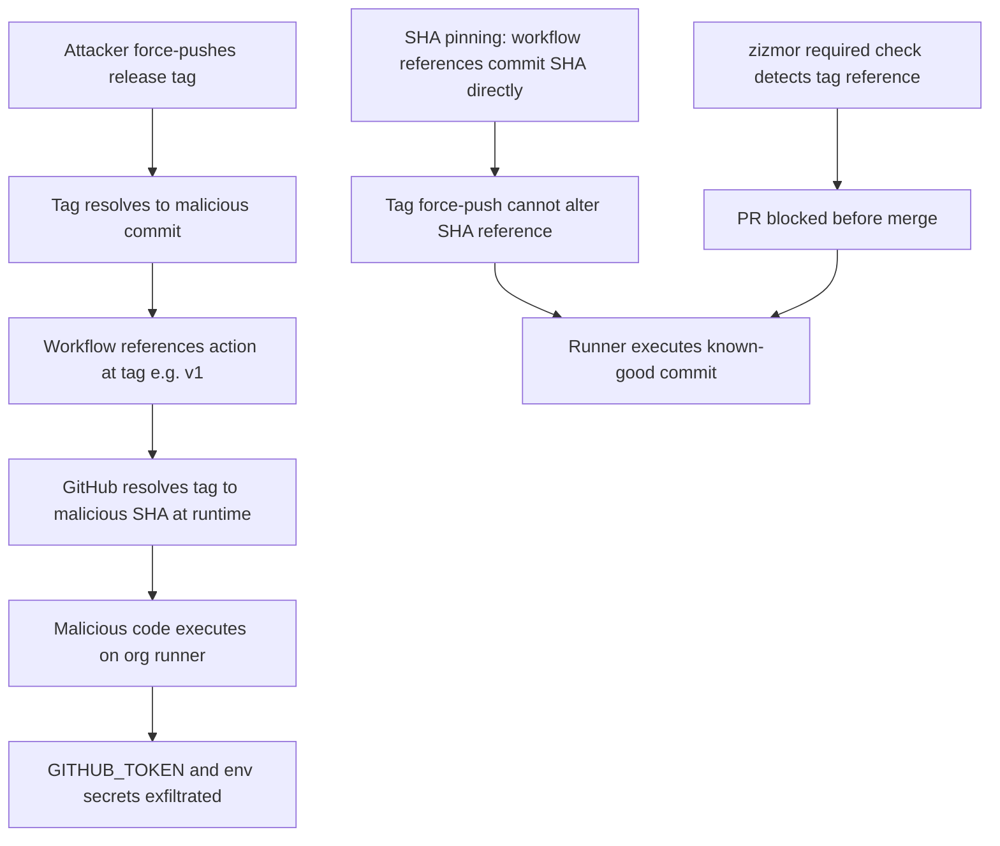

# Repository Standards

This document maps every repo-level artifact to its purpose and the rationale behind non-obvious decisions. It is the checklist for replicating these standards in a sibling repo. For component design see [ARCHITECTURE.md](ARCHITECTURE.md); for MCP tool design principles see [MCP-BEST-PRACTICES.md](MCP-BEST-PRACTICES.md).

## Artifact Map

| Artifact | Purpose |
|---|---|
| `.github/ISSUE_TEMPLATE/bug.md` | Structured bug reports; includes root cause hypothesis field to accelerate triage |
| `.github/ISSUE_TEMPLATE/feature.md` | Feature requests with scope boundary section to prevent creep |
| `.github/ISSUE_TEMPLATE/refactor.md` | Tracks refactors as first-class work, not hidden in feature PRs |
| `.github/PULL_REQUEST_TEMPLATE.md` | Verification checklist: tests, clippy, fmt, no-unwrap, API verification, GPG+DCO |
| `.github/copilot-instructions.md` | Repo context for Copilot agents |
| `.github/workflows/ci.yml` | Lint, test, audit; path-filtered; aggregate `CI Result` job; pass `--profile ci` explicitly on `cargo clippy` (not `cargo test`: profile.ci inherits `panic=abort` which aborts the test harness) |
| `.github/workflows/build-and-attest.yml` | Reusable multi-platform build with cosign signing and provenance attestation |
| `.github/workflows/release.yml` | GPG tag verification, Homebrew + cargo-binstall + crates.io distribution |
| `.commitlintrc.yml` | Enforces Conventional Commits for automated changelog and searchable history |
| `clippy.toml` | Clippy configuration; lints enforced with `-D warnings` in CI; cognitive complexity threshold set to 30 |
| `deny.toml` | `cargo deny` configuration for advisory and license checks |
| `renovate.json` | Automated dependency updates via Renovate bot |
| `CONTRIBUTING.md` | Dev setup, commit format, PR process |
| `SECURITY.md` | Vulnerability disclosure policy |
| `Cargo.toml` `[profile.release]` | `opt-level=z`, `lto=true`, `codegen-units=1`, `panic=abort`, `strip=true` for minimal distribution binaries |
| `Cargo.toml` `[profile.ci]` | Inherits release; `lto=false`, `codegen-units=16` for faster CI builds without sacrificing correctness |
| `.github/workflows/ci.yml` permissions block | Top-level `permissions:` block on every workflow. Use `contents: read` + `pull-requests: read` for CI workflows; set the minimum required permissions per job, noting that jobs using `actions/checkout` need at least `contents: read`. Required even after the org default was flipped to `read` on 2026-03-25, as defence in depth. |
| Runner pin (`ubuntu-24.04`) | Pin every job to `ubuntu-24.04` rather than `ubuntu-latest`. `ubuntu-latest` resolves to the newest image mid-cycle and can silently change toolchain versions between runs. |

*Table 1: Repository artifact map and purpose of each file.*

## Non-obvious Decisions

**Rulesets over legacy branch protection.** GitHub Rulesets apply consistently across the organization and support conditions the legacy API cannot express. Two rulesets are active: main branch protection (no force push, no deletion, required status on `CI Result`) and release tag protection (`v*.*.*` format, no overwrites).

**Single aggregate CI check.** `ci.yml` ends with a `CI Result` job that depends on all others. GitHub requires only this one check to pass. A single required check is simpler to reason about and eliminates the maintenance cost of keeping the required-checks list in sync with job names. Use the following `if:` condition so that path-filtered jobs (result: `skipped`) do not block the check, while `cancelled` and `failure` still fail it:

```yaml
# CI Result aggregator job -- list every job in 'needs'
ci-result:
  name: CI Result
  runs-on: ubuntu-24.04
  if: always()
  needs: [changes, commitlint, check-base, format, lint, test, deny, msrv, renovate-check, zizmor]
  steps:
    - name: Verify all jobs passed or were skipped
      run: |
        if [[ "${{ contains(needs.*.result, 'failure') || contains(needs.*.result, 'cancelled') }}" == "true" ]]; then
          echo "::error::One or more CI jobs failed or were cancelled."
          exit 1
        fi
        echo "All CI jobs passed or were skipped."
```

**Path-based change detection.** Format, lint, and test jobs run only when `src/**`, `Cargo.*`, `tests/**`, or workflow files change. Documentation-only pushes skip expensive jobs and give faster feedback.

**Provenance attestation.** `build-and-attest.yml` generates a signed attestation via `actions/attest-build-provenance`. Consumers can verify with `gh attestation verify` before installing. `Cargo.lock` is committed and `cargo deny` enforces license and advisory checks in CI. Build provenance is covered by cosign signing and `actions/attest-build-provenance` (SLSA Build L3).

**Runner pinning to ubuntu-24.04.** `ubuntu-latest` is a moving alias; GitHub advances it to the next LTS image with short notice. Pinning to a specific image (`ubuntu-24.04`) makes toolchain changes explicit and reviewable rather than silent. Renovate keeps the pin current via automated PRs.

**Cognitive complexity threshold.** `clippy::cognitive_complexity` is enforced at a threshold of 30 (set in `clippy.toml`); `-D warnings` promotes violations to hard errors in CI. When a function legitimately exceeds the threshold and splitting it would reduce clarity rather than improve it, suppress with an attribute and a mandatory `reason` field:

```rust
#[allow(clippy::cognitive_complexity, reason = "<why this function cannot be meaningfully split>")]
```

Do not raise the global threshold to accommodate a single outlier. The `reason` field is required: it documents intent for reviewers and makes the suppression searchable. Macro-expanded code can inflate scores artificially; this is a known upstream limitation (rust-lang/rust-clippy#14417).

**Permissions-first sequencing.** The org default GITHUB_TOKEN permission was flipped to `read` on 2026-03-25. New repos work without per-workflow blocks, but explicit blocks are still required as defence in depth and should be placed before the first `jobs:` key by convention for readability.

## Merge Strategy

**Squash merge only.** The repository is configured with `allow_squash_merge: true`, `delete_branch_on_merge: true`, and merge commits and rebase merges disabled. Squash merging linearizes the commit history and prevents feature branches from adding noise; automatic branch deletion keeps the repository clean.

## Applying to a New Repo

1. **GitHub metadata:** Set topics, copy the 11-label taxonomy (names, colors, descriptions), create the two rulesets.
2. **Templates:** Copy all three issue templates and the PR template; adapt wording to the target domain.
3. **CI:** Copy `ci.yml`; update path filters; pin runner to `ubuntu-24.04` on every job; add a top-level `permissions` block with `contents: read` and `pull-requests: read`; pass `--profile ci` on `cargo clippy` (not `cargo test`). Set `CI Result` as the sole required status check in the branch ruleset. Copy `.commitlintrc.yml`.
4. **Release:** Copy `build-and-attest.yml` and `release.yml`; update distribution channel config.
5. **Cargo profiles:** Copy the `[profile.release]` and `[profile.ci]` blocks verbatim.
6. **Docs:** Add `ARCHITECTURE.md` for the target repo; link this document and the orchestration guide from README.


## Security Hardening

These controls address GitHub Actions supply chain attacks and credential compromise. Each control references the specific incident or attack vector it mitigates. Replace `{org}` with the organization slug in all API calls.

### Workflow Permissions

**1. Actions Permissions (Org-Wide)**

The default `GITHUB_TOKEN` carries write permissions to repository contents; restricting it to read-only limits the blast radius of a compromised workflow. Setting `allowed_actions: selected` blocks unreviewed third-party actions at queue time, before they reach a runner. The `sha_pinning_required` field enforces commit-SHA pinning for all allowed actions at the organization level, complementing the zizmor per-PR check.

```bash
# Restrict GITHUB_TOKEN to read-only, enable action allowlist, and require SHA pinning
gh api \
  --method PUT \
  -H "Accept: application/vnd.github+json" \
  -H "X-GitHub-Api-Version: 2022-11-28" \
  /orgs/{org}/actions/permissions \
  -f enabled_repositories=all \
  -f allowed_actions=selected \
  -F sha_pinning_required=true

gh api \
  --method PUT \
  -H "Accept: application/vnd.github+json" \
  -H "X-GitHub-Api-Version: 2022-11-28" \
  /orgs/{org}/actions/permissions/workflow \
  -f default_workflow_permissions=read \
  -F can_approve_pull_request_reviews=false

# Populate the action allowlist (run after setting allowed_actions=selected above)
gh api \
  --method PUT \
  -H "Accept: application/vnd.github+json" \
  -H "X-GitHub-Api-Version: 2022-11-28" \
  /orgs/{org}/actions/permissions/selected-actions \
  -f github_owned_allowed=true \
  -F verified_allowed=false \
  --field 'patterns_allowed[]=wagoid/commitlint-github-action@*'
```
*Code Snippet 1: Org-wide GITHUB_TOKEN read-only enforcement, action allowlist population, and SHA pinning.*

**Enforcement state (2026-03-25).** Org default GITHUB_TOKEN permission set to `read`. All active workflows carry an explicit `permissions:` block as defence in depth. Per-workflow pattern for CI: `contents: read` / `pull-requests: read`. Minimum required permissions set per job; jobs using `actions/checkout` need at least `contents: read`.

**4. `pull_request_target` Audit and Ban**

The initial Trivy breach (February 28, 2026) was enabled by a `pull_request_target` workflow present since October 2025: it allowed a malicious fork PR to steal an org-scoped PAT. Poutine had flagged the pattern three months before the breach. The combination of `pull_request_target`, access to secrets, and checkout of the PR head SHA is the highest-risk pattern in GitHub Actions.

Run poutine as a required CI status check. If `pull_request_target` is unavoidable, isolate every secret behind an Environment with required reviewers and never check out `github.event.pull_request.head.sha`.

```yaml
# poutine step in CI; add as a required status check
- name: Audit workflow security
  uses: boostsecurityio/poutine-action@84c0a0d32e8d57ae12651222be1eb15351429228  # v0.15.2
  with:
    action: analyze_local
```

```bash
# Org-wide audit for pull_request_target usage via gh api with base64 decode
gh api /orgs/{org}/repos --paginate --jq '.[].full_name' | while read repo; do
  gh api /repos/$repo/contents/.github/workflows --jq '.[].path' 2>/dev/null | \
  while read path; do
    content=$(gh api /repos/$repo/contents/$path --jq '.content' | base64 -d 2>/dev/null)
    if echo "$content" | grep -q 'pull_request_target'; then
      echo "FOUND: $repo/$path"
    fi
  done
done
```
*Code Snippet 2: poutine CI step and org-wide audit for `pull_request_target` workflows.*

**6. Fork PR Workflow Approval**

Requiring approval before CI runs on fork PRs prevents untrusted code from executing on org runners and avoids burning CI minutes on first-time contributors before a maintainer has reviewed the PR. The `first_time_contributors` policy requires approval only from contributors with no merged PR; contributors who have had a PR merged run CI freely alongside org members and collaborators.

```bash
# Set org-wide default
gh api \
  --method PUT \
  -H "Accept: application/vnd.github+json" \
  -H "X-GitHub-Api-Version: 2022-11-28" \
  /orgs/{org}/actions/permissions/fork-pr-contributor-approval \
  -f approval_policy=first_time_contributors

# Apply to all existing repos (org setting applies to new repos automatically)
gh api /orgs/{org}/repos --paginate --jq '.[].full_name' | while read repo; do
  gh api \
    --method PUT \
    -H "Accept: application/vnd.github+json" \
    -H "X-GitHub-Api-Version: 2022-11-28" \
    /repos/$repo/actions/permissions/fork-pr-contributor-approval \
    -f approval_policy=first_time_contributors
done
```
*Code Snippet 3: Set fork PR approval policy across all org repos.*

| Setting | Who must wait for approval | Who runs CI freely |
|---|---|---|
| `first_time_contributors` | First-time contributors with no merged PR | Org members; collaborators; contributors with a merged PR |
| `all_external_contributors` | All non-members, including repeat contributors | Org members only |

*Table 2: `first_time_contributors` vs `all_external_contributors` fork PR approval policy comparison.*

**13. CODEOWNERS on `.github/workflows/`**

A compromised contributor account with write access can modify workflow files to exfiltrate secrets or escalate privileges. Requiring CODEOWNERS review on workflow changes adds a mandatory human gate that applies even to collaborators with write access.

```bash
# .github/CODEOWNERS entry: require security-reviewers team approval for all workflow changes
.github/workflows/ @{org}/security-reviewers
```

```yaml
# Branch ruleset pull_request rule parameters for .github/workflows/ protection
# Apply via PATCH /orgs/{org}/rulesets/{ruleset_id} (workflow-file protection ruleset)
parameters:
  required_approving_review_count: 1
  require_code_owner_review: true
  dismiss_stale_reviews_on_push: true
```

```yaml
# Branch ruleset pull_request rule parameters for main branch protection (solo repos)
# bypass_mode: pull_request -- actor can bypass only via a PR, preserving audit trail
# require_code_owner_review: false -- CODEOWNERS still routes review requests; no merge block
# Actor IDs are org-specific. Obtain via: gh api /orgs/{org}/rulesets | jq '.[].bypass_actors'
# or from the GitHub UI (Settings > Rules > Rulesets > edit ruleset > Bypass list).
parameters:
  required_approving_review_count: 0
  require_code_owner_review: false
  dismiss_stale_reviews_on_push: true
  bypass_actors:
    - actor_type: OrganizationAdmin
      actor_id: {ORG_ADMIN_ACTOR_ID}
      bypass_mode: pull_request
    - actor_type: RepositoryRole
      actor_id: {REPO_ADMIN_ROLE_ACTOR_ID}
      bypass_mode: pull_request
```
*Code Snippet 4: CODEOWNERS entry and branch ruleset parameters for workflow-file protection and main branch protection.*

### Supply Chain Integrity

**2. SHA Pinning**

In February-March 2026, an attacker force-pushed 75 tags in the aquasec/trivy repository; any workflow using `uses: action@tag` silently resolved to the malicious commit and executed attacker-controlled code on org runners. Pinning to a commit SHA makes tag force-push attacks impossible because the SHA reference is immutable.

Enforce SHA pinning via zizmor as a required CI status check. Renovate or Dependabot opens PRs to keep pinned SHAs current when upstream releases new versions. The `sha_pinning_required` org setting (Control 1) enforces pinning at queue time; zizmor provides per-PR feedback during code review.


*Figure 1: Tag poisoning attack chain and how SHA pinning combined with zizmor breaks it.*

```yaml
# zizmor step in CI; pin zizmor itself to a SHA
- name: Lint GitHub Actions workflows
  uses: zizmorcore/zizmor-action@71321a20a9ded102f6e9ce5718a2fcec2c4f70d8  # v0.5.2
  with:
    severity: medium
```
*Code Snippet 5: zizmor CI step for SHA pinning enforcement.*

Use `advanced-security: false` unless the repo has GitHub Advanced Security (GHAS) enabled. Setting it to `true` on a non-GHAS repo causes zizmor to emit false positives for features that are unavailable. `min-severity: high` suppresses informational and medium findings that do not represent exploitable vulnerabilities in typical org workflows.

```yaml
# .github/dependabot.yml: keep action SHAs current via weekly PRs
version: 2
updates:
  - package-ecosystem: github-actions
    directory: /
    schedule:
      interval: weekly
    groups:
      actions:
        patterns:
          - "*"
```
*Code Snippet 6: Dependabot configuration for the `github-actions` ecosystem.*

**3. OIDC Trusted Publishers: No Stored Registry Tokens**

The LiteLLM breach involved a stored `PYPI_PUBLISH_PASSWORD` exfiltrated from a compromised runner and used post-breach to push backdoored packages to PyPI, bypassing CI entirely. OIDC tokens are short-lived, scoped to the workflow run, and never stored; an exfiltrated OIDC token has already expired before it can be reused.

Configure PyPI, npm, and RubyGems as Trusted Publishers in each registry's dashboard, then use the short-lived token in the publish workflow with no `password=` field.

```yaml
# Publish workflow using OIDC; no stored registry token
name: Publish
on:
  push:
    tags: ["v*.*.*"]
jobs:
  publish:
    runs-on: ubuntu-24.04
    environment: publish
    permissions:
      id-token: write  # required to request an OIDC token
      contents: read
    steps:
      - uses: actions/checkout@de0fac2e4500dabe0009e67214ff5f5447ce83dd  # v6
      - name: Publish to PyPI
        uses: pypa/gh-action-pypi-publish@ed0c53931b1dc9bd32cbe73a98c7f6766f8a527e  # v1.13.0
        # no password= field; OIDC token is requested automatically via id-token: write
```
*Code Snippet 7: Publish workflow using OIDC Trusted Publisher; no stored registry token.*

```bash
# Audit org secrets for stored registry tokens
gh api /orgs/{org}/actions/secrets --paginate --jq \
  '.secrets[].name | select(test("PYPI|NPM|RUBYGEMS|DOCKER|PUBLISH"; "i"))'
```
*Code Snippet 8: List org secrets matching common registry token name patterns.*

**10. Tag Immutability Ruleset and Signed Commits**

In the aquasec/trivy incident, the attacker force-pushed 75 release tags. A tag protection ruleset blocking deletion, non-fast-forward updates, and any update to `refs/tags/**` prevents this at the Git protocol layer, including for administrators. The `required_signatures` rule on the default branch ruleset ensures every commit in the release path is GPG-signed.

```bash
# Create an org-level tag immutability ruleset
gh api \
  --method POST \
  -H "Accept: application/vnd.github+json" \
  -H "X-GitHub-Api-Version: 2022-11-28" \
  /orgs/{org}/rulesets \
  --input - <<'EOF'
{
  "name": "Tag immutability",
  "target": "tag",
  "enforcement": "active",
  "conditions": {
    "ref_name": {
      "include": ["refs/tags/**"],
      "exclude": []
    }
  },
  "rules": [
    { "type": "deletion" },
    { "type": "non_fast_forward" },
    { "type": "update" },
    { "type": "required_signatures" }
  ]
}
EOF
```
*Code Snippet 9: Org-level tag immutability ruleset blocking deletion, force-push, and unsigned tags.*

**11. Pinned Tool Versions and Hash Verification in CI**

During the LiteLLM incident, CI ran `apt install trivy` without a pinned version and installed the compromised v0.69.4. Any `apt install <tool>`, `pip install`, `curl | bash`, or unpinned Docker image tag is the same attack surface as an unpinned action.

Pin every tool to a specific version and verify the SHA256 digest before execution. For Docker images, use the image digest (`@sha256:...`) instead of a tag in `FROM` and `docker pull`.

```bash
# Pin a binary download to a specific version and verify SHA256 before execution
TOOL_VERSION="1.2.3"
TOOL_URL="https://example.com/tool-${TOOL_VERSION}-linux-amd64.tar.gz"
EXPECTED_SHA256="<sha256-of-tool-tarball>"  # obtain from the upstream release page

curl -fsSL "$TOOL_URL" -o tool.tar.gz
echo "${EXPECTED_SHA256}  tool.tar.gz" | sha256sum --check
tar -xzf tool.tar.gz

# Docker: use image digest instead of a tag
# Dockerfile:
#   FROM ubuntu@sha256:<digest-from-upstream>
# CLI pull:
#   docker pull ubuntu@sha256:<digest-from-upstream>
```
*Code Snippet 10: SHA256 verification before binary execution and Docker image digest pinning.*

### Credential and Access Management

**7. Secret Scanning with gitleaks**

Secret scanning runs on every PR and push as a required CI check using a shared org-level configuration and license secret. This prevents long-lived tokens committed to any repository from persisting in history or appearing in CI log artifacts. Before enabling as a required check, run a full-history scan across all org repos with `gitleaks detect --source .` to resolve any pre-existing findings; a required check on a repo with unresolved history violations will block all PRs immediately.

```yaml
# gitleaks workflow step referencing org-level license and config secrets
- name: Scan for committed secrets
  uses: gitleaks/gitleaks-action@ff98106e4c7b2bc287b24eaf42907196329070c7  # v2.3.9
  env:
    GITHUB_TOKEN: ${{ secrets.GITHUB_TOKEN }}
    GITLEAKS_LICENSE: ${{ secrets.GITLEAKS_LICENSE }}
    GITLEAKS_CONFIG: ${{ secrets.GITLEAKS_CONFIG }}
```
*Code Snippet 11: gitleaks required CI check using org-level license and configuration secrets.*

**Full-history scan result (2026-03-25).** Ran `gitleaks detect --source .` across all org repos. Result: clean. All findings were false positives from test fixtures and example tokens. Recommendation: add a `.gitleaks.toml` allowlist to `aptu` to suppress test-fixture false positives and reduce noise in future scans.

**8. Fine-Grained PATs Only, Classic PATs Banned, Expiry Enforced**

Classic PATs grant wildcard access across all repositories a user can access; fine-grained PATs are scoped per repository and per permission. After the Aqua breach, token rotation was non-atomic and the gap lasted days: the correct procedure is to revoke all tokens, re-issue all tokens, and verify old tokens are dead in a single scripted operation.

PAT type restriction and token expiry limits are configured in the GitHub UI: Org Settings > Personal access tokens > Restrict access > "Require approval" and "Token expiration". The fork restriction below is patchable via API.

```bash
# Prevent members from forking private repositories (patchable via API)
gh api \
  --method PATCH \
  -H "Accept: application/vnd.github+json" \
  -H "X-GitHub-Api-Version: 2022-11-28" \
  /orgs/{org} \
  -F members_can_fork_private_repositories=false

# Audit org secrets for tokens that should be replaced with OIDC or fine-grained PATs
gh api /orgs/{org}/actions/secrets --paginate --jq '.secrets[].name'
```
*Code Snippet 12: Prevent private repository forks and audit org secrets for tokens requiring rotation.*

**PAT inventory (2026-03-25).** No legacy OAuth token authorizations. Four installed GitHub Apps: Renovate, Prefect Horizon, DCO, clouatre-labs-org-admin.

**9. GitHub Apps, 2FA, and SAML SSO**

GitHub Apps receive short-lived installation tokens scoped to the installation and cannot be reused outside the workflow run, reducing the value of any single exfiltrated token. 2FA and SAML SSO are the minimum authentication baseline for org members; an account without 2FA is one phishing attempt away from full repository access. Enable 2FA enforcement in Org Settings > Authentication security > Require two-factor authentication.

If a PAT is unavoidable, it must be fine-grained, scoped to a single repository, use minimum required permissions, and have a 90-day maximum expiry.

```bash
# Audit active credential authorizations
gh api /orgs/{org}/credential-authorizations --paginate \
  --jq '.[] | {login: .login, credential_type: .credential_type, token_last_eight: .token_last_eight}'
```
*Code Snippet 13: Audit active credential authorizations to identify long-lived or classic tokens.*

**2FA enforcement state (2026-03-25).** Organization-level 2FA requirement enabled. Zero members without 2FA. All members verified.

### Environment and Release Protection

**5. Environment Protection and Required Reviewers on Publish Jobs**

Publish, deploy, and sign jobs are gated on GitHub Environments configured with required reviewers, making it structurally impossible to trigger them from a fork PR or unapproved ref. Secrets are scoped to the Environment, not the repository level: even if a maintainer account is compromised, a second maintainer must approve before secrets reach the runner.

```bash
# Create a protected publish environment with required reviewer and branch restriction
# Replace {reviewer_id} with the GitHub user or team numeric ID
gh api \
  --method PUT \
  -H "Accept: application/vnd.github+json" \
  /repos/{org}/{repo}/environments/publish \
  --input - <<'EOF'
{
  "wait_timer": 0,
  "prevent_self_review": true,
  "reviewers": [
    { "type": "User", "id": "{reviewer_id}" }
  ],
  "deployment_branch_policy": {
    "protected_branches": true,
    "custom_branch_policies": false
  }
}
EOF
```
*Code Snippet 14: Publish environment with required reviewer and protected-branch deployment policy.*

### Audit and Visibility

**12. Audit Log and Alerting**

The Aqua breach was detected externally, not by the org. Querying the audit log for high-signal events enables detection of the patterns that precede or confirm a breach: tag mutations on release repos, unexpected repository creation used for exfiltration staging, out-of-band member additions, and bursts of secret scanning bypass events. Audit log streaming to a SIEM is available on GitHub Enterprise plans; on Team and Free plans, use the audit log query API with a scheduled job or webhook.

```bash
# Query org audit log (available on all plans)
gh api "/orgs/{org}/audit-log?phrase=action:tag.create+action:repo.create&per_page=100" \
  --paginate \
  --jq '.[] | {action: .action, actor: .actor, repo: .repo, created_at: .created_at}'

# Events to alert on:
# tag.create / tag.update      unexpected mutations on release repos
# repo.create                  unexpected new repositories (exfiltration staging)
# org.invite_member            out-of-band member additions
# org.add_member               out-of-band member additions
# secret_scanning.bypass       bursts indicate active exfiltration attempt
```
*Code Snippet 15: Audit log query and high-signal event types to alert on.*

### Summary

| # | Control | Attack or Risk Blocked | Enforcement Path |
|---|---|---|---|
| 1 | Actions permissions | Overprivileged GITHUB_TOKEN; unreviewed third-party actions | `PUT /orgs/{org}/actions/permissions` |
| 2 | SHA pinning | Tag poisoning (Trivy breach, Feb-Mar 2026) | zizmor required check; Renovate or Dependabot |
| 3 | OIDC Trusted Publishers | Stored registry token exfiltration (LiteLLM breach) | Workflow hardening; no `password=` field |
| 4 | `pull_request_target` ban | Fork PR PAT theft (Trivy breach, Feb 28 2026) | poutine required check; workflow audit |
| 5 | Environment protection | Secrets reachable from fork PRs or unapproved refs | `PUT /repos/{org}/{repo}/environments/{name}` |
| 6 | Fork PR workflow approval | Untrusted code on org runners; wasted CI minutes | `PUT /orgs/{org}/actions/permissions/fork-pr-contributor-approval` |
| 7 | Secret scanning (gitleaks) | Long-lived tokens persisting in repository history | gitleaks required check |
| 8 | Fine-grained PATs; classic banned | Wide-scope token exfiltration; non-atomic rotation gap | GitHub org Settings UI; `PATCH /orgs/{org}` |
| 9 | GitHub Apps; 2FA; SAML | Long-lived automation secrets; account takeover via phishing | GitHub org Settings UI; GitHub App installation |
| 10 | Tag immutability ruleset | Tag force-push (Trivy breach, Feb-Mar 2026) | `POST /orgs/{org}/rulesets` |
| 11 | Pinned tool versions | Compromised package via unpinned install (LiteLLM breach) | Workflow hardening; SHA256 verification |
| 12 | Audit log and alerting | Breach invisible to org until external disclosure (Aqua breach) | `GET /orgs/{org}/audit-log` |
| 13 | CODEOWNERS on workflows | Workflow modification by compromised contributor account | CODEOWNERS; branch ruleset |

*Table 3: Security hardening controls, risks blocked, and enforcement path.*
