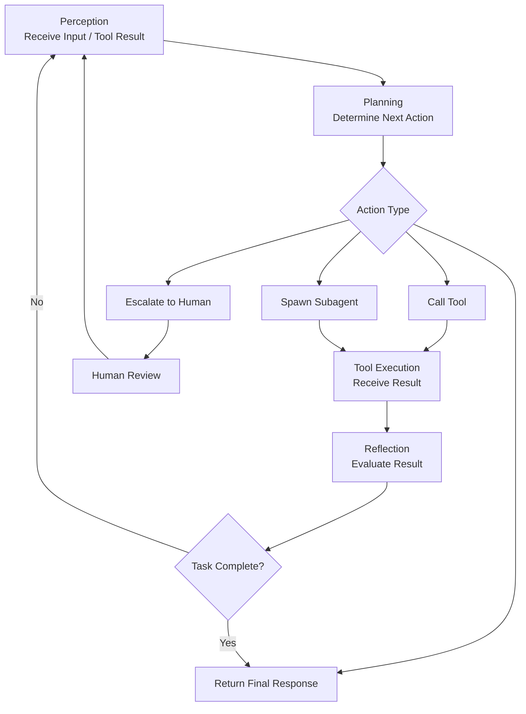
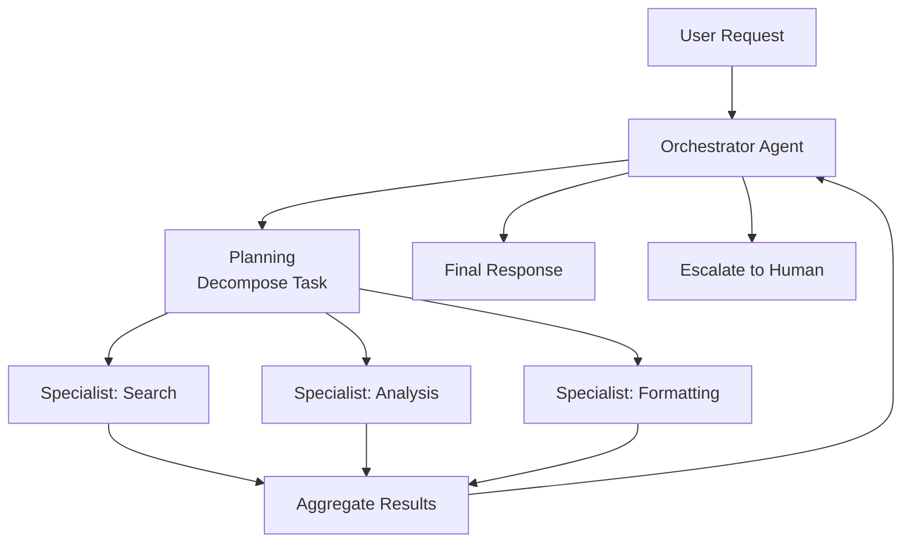
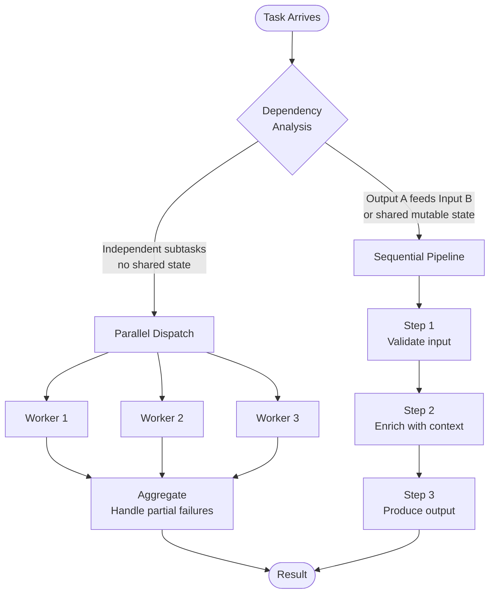
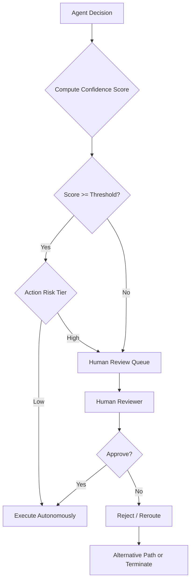

# MCP, Agents, and Orchestration: Best Practices

## Overview

This document is a production reference for engineers building systems with Claude and the Model Context Protocol (MCP). It covers the agentic loop, orchestration patterns, MCP tool design, memory management, safety controls, and prompt engineering for agents, cross-referenced against the MCP specification (2025-06-18), official Anthropic SDK documentation, and security references.

The scope covers three interrelated areas: the mechanics of the agentic loop and how agents perceive, plan, act, and reflect; orchestration patterns for coordinating multiple agents and managing context at scale; and MCP as the interface layer through which agents access tools and external data.

A senior engineer reading this document should be able to design a production agent system, write compliant MCP tool definitions, choose the right orchestration pattern for a given workload, and recognize the failure modes that make agentic systems fragile or unsafe.

## See Also

- [ARCHITECTURE.md](ARCHITECTURE.md) - module map and data flow for this MCP server implementation
- [MCP Specification 2025-06-18](https://modelcontextprotocol.io/specification/2025-06-18/server/tools) - canonical protocol reference
- [DESIGN-GUIDE.md](DESIGN-GUIDE.md) - Design decisions, rationale, and replication guide for building high-performance MCP servers

---

## 1. The Agentic Loop

### 1.1 Core Components

The agentic loop is the fundamental execution model for Claude-based agents. It consists of four phases that repeat until the agent reaches a terminal state:

1. **Perception**: The agent receives input, which may be a user message, a tool result, or a structured handoff from another agent.
2. **Planning**: The agent determines which action to take next, including which tool to call, whether to delegate to a subagent, or whether to escalate to a human.
3. **Tool Execution**: The agent calls one or more tools and receives results. Tool calls are sent as assistant messages; results are returned as `tool_result` blocks in a subsequent user message (Anthropic SDK, tool use format).
4. **Reflection**: The agent evaluates the result, decides whether the task is complete, and either terminates or enters the next perception phase.

The loop continues until `stop_reason` is no longer `tool_use`. In practice, this means the orchestrating code must detect `stop_reason == "tool_use"` and route execution accordingly.



*Figure 1: The agentic loop: perception, planning, tool execution, and reflection cycle with escalation path.*

The orchestrating code drives the loop by detecting `stop_reason`. When the model returns `tool_use`, dispatch each tool call and inject all results as a `tool_result` block before the next invocation:

```python
import anthropic

client = anthropic.Anthropic()
messages = [{"role": "user", "content": user_input}]

while True:
    response = client.messages.create(
        model="claude-haiku-4-5",
        max_tokens=4096,
        tools=tools,
        messages=messages,
    )
    messages.append({"role": "assistant", "content": response.content})

    if response.stop_reason != "tool_use":
        break  # terminal: end_turn, max_tokens, or stop_sequence

    tool_results = []
    for block in response.content:
        if block.type == "tool_use":
            result = dispatch_tool(block.name, block.input)
            tool_results.append({
                "type": "tool_result",
                "tool_use_id": block.id,
                "content": result,
            })
    messages.append({"role": "user", "content": tool_results})

final_text = next(b.text for b in response.content if b.type == "text")
```

*Code Snippet 1: Agentic loop in Python using the Anthropic SDK. Tool results are injected as a `tool_result` block before the next model call.*

### 1.2 When to Use Agents

Use an agentic architecture when the task requires:

- Multiple sequential or parallel tool calls where the results of one call determine the next action.
- Delegation of subtasks to specialized agents with distinct context or toolsets.
- Dynamic decision-making that cannot be reduced to a fixed pipeline.
- Human-in-the-loop checkpoints where confidence or policy coverage is insufficient.

Avoid an agentic architecture for simple request-response tasks, single-tool lookups, or workloads where the full pipeline is known in advance and can be hardcoded. Over-engineering a linear task as an agent introduces latency, cost, and failure surface with no benefit.

---

## 2. Orchestration Patterns

### 2.1 Orchestrator / Specialist Architecture

The orchestrator pattern separates coordination logic from domain execution. An orchestrator agent receives the top-level task, decomposes it, routes subtasks to specialist agents, aggregates results, and manages session state. Specialist agents focus on a single domain and operate within a narrow toolset.

This separation produces two concrete benefits. First, each specialist operates on a lean context containing only what is relevant to its domain, avoiding the token bloat that occurs when unrelated work accumulates in a single context. Second, specialist agents can be tested, versioned, and replaced independently of the orchestrator.

The orchestrator is responsible for:
- Maintaining the canonical session state and message history.
- Routing tool call failures to retry logic or escalation.
- Aggregating partial results from parallel or sequential specialist invocations.
- Deciding when the composite task is complete.



*Figure 2: Orchestrator/specialist architecture with parallel specialist execution and result aggregation.*

### 2.2 Parallel vs Sequential Execution

Choose between parallel and sequential delegation based on data dependencies between subtasks.

**Sequential delegation** applies when each subtask depends on results from the previous one. The output of one specialist becomes the input to the next. Sequential workflows are easier to debug because the state at each step is deterministic, but they accumulate latency.

**Parallel execution** applies when subtasks are independent. Multiple specialists run simultaneously; the orchestrator waits for all results before proceeding. Parallel execution reduces wall-clock time but requires the orchestrator to handle partial failures: if one specialist fails, the orchestrator must decide whether to retry, proceed without that result, or escalate.



*Figure 3: Scheduling strategy derived from data dependency: independent subtasks dispatch in parallel; dependent subtasks form a sequential pipeline.*

### 2.3 Context Passing and Handoffs

Context passing is the mechanism by which an orchestrator shares relevant state with a subagent without flooding that agent's context window with irrelevant history.

Effective handoffs follow these rules:

- Pass only the information the subagent needs to complete its task. Trim conversation history to the relevant subset before constructing the subagent's message array.
- Use structured formats (JSON objects or typed schemas) for handoffs rather than prose summaries. Structured formats are unambiguous and can be validated programmatically.
- Include the task description, relevant prior results, and any constraints or escalation criteria explicitly in the subagent's system prompt or first user message.
- Do not pass raw tool outputs verbatim when a summary is sufficient. Summarization reduces token consumption without losing the information the subagent requires.

A minimal structured handoff contains the task description, any prior results the subagent needs, explicit constraints, and escalation criteria:

```json
{
  "task": "Summarize Q3 financial report",
  "constraints": ["max 300 words", "focus on revenue and margins"],
  "prior_results": {
    "document_id": "doc_abc123",
    "extracted_tables": ["revenue", "expenses"]
  },
  "escalation_criteria": {
    "confidence_threshold": 0.85,
    "escalate_on": ["missing_data", "conflicting_figures"]
  }
}
```

*Code Snippet 2: Structured subagent handoff. The subagent receives only what it needs; raw history and unrelated state are excluded.*

---

## 3. Model Context Protocol (MCP)

### 3.1 Architecture Overview

MCP defines a client/server protocol through which a host application (the MCP client, typically Claude or a Claude-powered agent) discovers and calls tools, reads resources, and uses prompts exposed by an MCP server (MCP specification 2025-06-18, server/tools).

The server exposes a catalog of tools. The client queries that catalog at session start and receives tool definitions including name, description, and input schema. When the model decides to use a tool, the client sends a tool call to the server, receives the result, and injects it into the conversation as a `tool_result` block.

The server also exposes resources (arbitrary data identified by URI) and prompts (predefined instruction templates). Resources are read by the client and injected into context. Prompts are user-controlled templates that standardize instruction patterns across teams (MCP specification, server/resources; modelcontextprotocol.info, concepts/prompts).

### 3.2 Tool Design Principles

Three principles govern tool design at the MCP layer:

1. **Single responsibility**: Each tool does one thing well. A tool that searches for files and also reads their contents is harder to describe, harder to test, and harder to route correctly than two tools with distinct responsibilities.
2. **Non-overlapping functionality**: Tools in the same server must not have overlapping behavior. When two tools can satisfy the same request, the model must guess which one to use. Ambiguous routing is a reliability failure, not a model failure.
3. **Clear, human-readable descriptions**: The description field is the primary signal the model uses to select a tool. A vague description ("process data") produces unreliable selection. A precise description ("Extract structured invoice fields from a PDF and return them as a JSON object matching the InvoiceSchema") produces reliable selection.

### 3.3 Tool Annotations

MCP tool definitions support annotations that communicate the behavioral characteristics of a tool to the client. These are not enforced at the protocol level but allow clients to present appropriate confirmation UI and apply policy rules (MCP specification 2025-06-18, server/tools).

| Annotation | Type | Meaning |
|---|---|---|
| `title` | `string` | Human-readable display name for the tool, shown in client confirmation UI. Distinct from the machine-readable `name` used in tool calls. |
| `readOnlyHint` | `boolean` | Tool does not modify external state. Safe to call without confirmation. |
| `destructiveHint` | `boolean` | Tool may delete or overwrite data. Requires user confirmation before calling. |
| `idempotentHint` | `boolean` | Calling the tool multiple times with the same input produces the same result. Safe to retry on failure. |
| `openWorldHint` | `boolean` | Tool accesses external services or data sources outside the server's control. Results may vary. |

*Table 1: MCP tool annotation fields and their semantics.*

Annotate every tool. An unannotated tool is treated as potentially destructive by cautious clients. Marking a read-only search tool as `readOnlyHint: true` allows clients to call it autonomously without a confirmation step, reducing latency and friction.

### 3.4 Transport Types

MCP supports three transport mechanisms (MCP specification, basic/transports):

| Transport | Use Case | Protocol |
|---|---|---|
| STDIO | Local integrations, CLI tools, same-host servers | Standard input/output streams, bidirectional |
| HTTP/SSE | Distributed systems, remote servers (legacy, pre-2025-03-26) | HTTP POST for requests, persistent SSE stream for responses |
| Streamable HTTP | Distributed systems, remote servers (preferred since 2025-03-26) | HTTP POST to single `/mcp` endpoint; inline response (stateless) or streaming session (stateful) |

*Table 2: MCP transport types, use cases, and protocols.*

For **HTTP/SSE** (legacy, deprecated since 2025-03-26): the client sends requests via HTTP POST and receives responses via a persistent Server-Sent Events stream. New server implementations should prefer Streamable HTTP.

For **Streamable HTTP** (preferred since 2025-03-26): the client POSTs JSON-RPC messages to a single `/mcp` endpoint. The server responds inline in the HTTP response body (stateless mode) or upgrades to a streaming session by returning a stream ID and subsequent events on the same endpoint (stateful mode). Proxy- and load-balancer-friendly because it does not require persistent SSE connections.

---

### 3.5 Elicitation

Elicitation (introduced in MCP 2025-06-18) allows a server to pause tool execution and request additional information from the user via a structured client-side form. This is the spec's mechanism for human-in-the-loop within a single tool call, without requiring the orchestrator to restart the call with new parameters.

**How it works:** During tool execution the server sends an `elicitation/create` request to the client, containing a human-readable message and an optional JSON Schema describing the expected input. The client presents this to the user and returns their response. Execution then resumes with the collected data.

**Two modes:**

| Mode | Description | Use case |
|------|-------------|----------|
| Form mode | Server provides a JSON Schema; client renders a structured form | Collecting missing parameters, confirmations |
| URL mode | Server provides an external URL; client opens it | OAuth flows, sensitive credential entry |

**Constraints:**
- Servers MUST NOT request sensitive credentials (passwords, API keys) via form mode. Use URL mode for sensitive flows.
- Clients may decline elicitation; servers must handle a declined or empty response gracefully.

**FastMCP usage:**
```python
result = await ctx.elicit(
    message="Which environment should this deploy to?",
    schema={"type": "object", "properties": {"env": {"type": "string", "enum": ["staging", "production"]}}, "required": ["env"]}
)
if result.action == "accept":
    env = result.data["env"]
```

**Reference:** [MCP 2025-06-18 Elicitation spec](https://modelcontextprotocol.io/specification/2025-06-18/client/elicitation)


## 4. Tool Use Best Practices

### 4.1 Tool Definition Schema

Tool definitions in the Anthropic API require three fields: `name`, `description`, and `input_schema`. The `input_schema` follows JSON Schema with `type: object`, a `properties` map, and a `required` array. Every property must include a `description` field (Anthropic SDK, tool use format).

```json
{
  "name": "get_weather",
  "description": "Get the current weather for a specific location. Returns temperature, conditions, and wind speed.",
  "input_schema": {
    "type": "object",
    "properties": {
      "location": {
        "type": "string",
        "description": "City and state or city and country, e.g. San Francisco, CA"
      },
      "unit": {
        "type": "string",
        "enum": ["celsius", "fahrenheit"],
        "description": "Temperature unit to return. Defaults to celsius if omitted."
      }
    },
    "required": ["location"]
  }
}
```

*Code Snippet 3: Anthropic API tool definition with input_schema, required fields, and optional enum parameter.*

The MCP specification extends this with an optional `outputSchema` field that documents the structure of the tool's return value. Defining an `outputSchema` enables downstream validation and allows orchestrators to verify that tool output matches expectations before injecting it into context (MCP specification 2025-06-18, server/tools).

```json
{
  "name": "searchFlights",
  "description": "Search for available flights between two cities on a given date.",
  "inputSchema": {
    "type": "object",
    "properties": {
      "origin": {
        "type": "string",
        "description": "Departure city IATA code, e.g. SFO"
      },
      "destination": {
        "type": "string",
        "description": "Arrival city IATA code, e.g. JFK"
      },
      "date": {
        "type": "string",
        "format": "date",
        "description": "Travel date in ISO 8601 format, e.g. 2025-06-15"
      }
    },
    "required": ["origin", "destination", "date"]
  },
  "outputSchema": {
    "type": "object",
    "properties": {
      "flights": {
        "type": "array",
        "items": {
          "type": "object",
          "properties": {
            "flight_number": {"type": "string"},
            "departure_time": {"type": "string"},
            "arrival_time": {"type": "string"},
            "price": {"type": "number"}
          }
        }
      },
      "total_count": {"type": "integer"}
    },
    "required": ["flights"]
  }
}
```

**Structured output:** `outputSchema` is optional. If defined, tool results must include a `structuredContent` field matching that schema alongside the traditional `content` array. The `content` array remains as the human-readable fallback. Some SDKs (including FastMCP) automatically populate `structuredContent` from the return type annotation; servers not using such an SDK must populate it explicitly. Example result:

```json
{
  "content": [{"type": "text", "text": "Found 42 flights from SFO to JFK"}],
  "structuredContent": {
    "flights": [
      {"flight_number": "AA123", "departure_time": "2025-06-15T08:00:00Z", "arrival_time": "2025-06-15T11:30:00Z", "price": 299.99}
    ],
    "total_count": 42
  }
}
```

*Code Snippet 4: MCP tool definition using inputSchema with format constraints and outputSchema for structured results.*

### 4.2 Specificity and Naming

Tool names must be unique within a server and should be action-oriented verb phrases that communicate intent without ambiguity. Names like `process`, `handle`, or `run` are disqualifying because they provide no disambiguation signal. Prefer names like `extract_invoice_fields`, `search_knowledge_base`, or `validate_address_format`.

Write descriptions that differentiate tools from their nearest neighbors. If you have both `search_documents` and `read_document`, the description of `search_documents` must state that it returns a ranked list of document references, while `read_document` returns the full content of a single document by ID. Without this differentiation, the model will conflate them in ambiguous requests.

Test tool selection reliability by constructing requests that could plausibly route to multiple tools and verifying which tool the model selects. Edge cases and ambiguous phrasing are the highest-value test scenarios.

### 4.3 Error Responses

Structured error responses are required for reliable agentic behavior. A bare exception message or an HTTP 500 response gives the orchestrator no information about whether to retry, escalate, or take an alternative action.

Every tool error response must include:

- **Error category**: A stable, machine-readable code such as `VALIDATION_ERROR`, `TIMEOUT`, `NOT_FOUND`, `RATE_LIMITED`, or `PERMISSION_DENIED`.
- **Retryable flag**: A boolean indicating whether calling the tool again (with the same or modified parameters) is likely to succeed.
- **User-facing message**: A human-readable description of the failure that can be surfaced in an escalation or log without exposing internal implementation details.

The orchestrator uses the error category and retryable flag to drive retry logic, fallback strategies, and escalation decisions. Without these fields, the orchestrator can only guess.

```json
{
  "error": {
    "category": "RATE_LIMITED",
    "retryable": true,
    "message": "The external flight API rate limit was exceeded. Retry after 30 seconds.",
    "retry_after_seconds": 30
  }
}
```

*Code Snippet 5: Structured error response with category, retryable flag, and user-facing message.*

### 4.4 Composition

Tools should be designed to work together, not in isolation. A tool that returns a document ID is useful only if another tool accepts that ID as input. When designing a toolset, model the data flow between tools explicitly: what does each tool produce, and what does each tool consume?

Design schemas with composability in mind:

- Use consistent identifier formats across tools (e.g., always use `document_id` as the field name for document references, never `id`, `doc_id`, or `ref`).
- Use nullable fields and optional arrays to allow tools to return partial results rather than failing when some data is unavailable.
- Avoid stateful tools that require calls to be made in a specific order unless that order is enforced by the schema.

Stateless tool design is the default preference. A stateless tool produces the same output for the same input regardless of prior calls, which makes it safe to retry, safe to call in parallel, and easier to cache.

---

## 5. Memory and Context Management

### 5.1 Memory Types

Agent memory spans five types, each with distinct persistence and access characteristics:

| Memory Type | Persistence | Storage | Access Mechanism |
|---|---|---|---|
| In-Context | Session only | Context window | Direct, zero latency |
| External / Long-term | Cross-session | Database, vector store | Query/retrieval |
| Episodic | Cross-session | Event log, few-shot examples | Retrieval or injection |
| Semantic | Persistent | Knowledge graph, structured DB | Query |
| Procedural | Permanent | Model weights, execution patterns | Implicit |

*Table 3: Agent memory types, persistence characteristics, and access mechanisms.*

**In-context memory** is transient working memory. It disappears when the session ends or when older tokens are pushed out of the window. This is where the current conversation, tool results, and intermediate state live.

**External memory** persists across sessions in databases or vector stores. It enables personalized experiences, cross-session continuity, and the ability to recall facts from prior interactions.

**Episodic memory** records specific past events with temporal context. In practice, this is often implemented through few-shot examples injected into the system prompt: the agent "remembers" how it handled a prior case by seeing a curated example of that case.

**Semantic memory** is a structured knowledge repository of facts and relationships, implemented as knowledge graphs or structured databases. It enables the agent to reason about relationships between concepts without relying on context window state.

**Procedural memory** encodes how to perform tasks. For language models, this is largely embedded in model weights. Execution patterns and agent frameworks add a procedural layer on top of the model's internalized knowledge.

### 5.2 Token Budget Management

Token budget management is required for any agent that runs long sessions or processes large documents. Three techniques reduce context growth:

1. **Summarization**: When a tool returns a verbose output, summarize it before inserting the summary into context. A search result that returns 2,000 words of text can usually be reduced to the three or four relevant facts without information loss.
2. **Subagent boundaries**: Delegate work to a specialist rather than accumulating the context for unrelated tasks in the orchestrator's window. Each subagent starts with a fresh context containing only what is necessary.
3. **Scratchpad files**: Write intermediate facts and state to external files rather than accumulating them in the context window. The orchestrator reads from the scratchpad selectively, pulling only the facts relevant to the current planning step.

Know the general patterns for token limits across Claude model tiers: Haiku for low-latency, cost-sensitive applications; Sonnet for balanced performance; Opus for complex reasoning tasks requiring maximum capability. Do not memorize exact token counts as they change across model versions.

### 5.3 Scratchpad Pattern

The scratchpad pattern externalizes working memory from the context window to a persistent file or key-value store. The agent writes facts, intermediate results, and state flags to the scratchpad at each step. When the agent needs a fact, it reads from the scratchpad rather than relying on the fact being present in context.

This pattern is particularly useful in multi-step pipelines where early results must be available many turns later. Without a scratchpad, the agent must either keep the full history in context (expensive) or risk losing track of earlier findings.

Implement the scratchpad as a structured file (JSON or YAML) rather than a prose document. Structured scratchpads are queryable, diffable, and less prone to the misinterpretation that can occur when the model reads back its own unstructured prose.

---

## 6. Safety, Trust, and Human-in-the-Loop

### 6.1 Escalation Triggers

Escalation to a human reviewer is required in three categories of situation:

1. **Policy gaps**: The agent lacks explicit rules or guidelines covering the decision at hand. Proceeding without policy coverage means the agent is improvising; improvised decisions in production carry unacceptable risk.
2. **Confidence threshold breach**: The agent's confidence in its decision falls below the configured threshold, even if the decision is technically feasible. Confidence-based escalation acknowledges that a technically possible action is not always the right action.
3. **Customer or contract impact**: The decision affects customer satisfaction, contractual obligations, or financial transactions. These categories require human accountability by definition.

Escalation transparency is a separate requirement: when escalating, the agent must make it clear why the decision was escalated, what information was available, and what the agent would have decided autonomously. Without this explanation, the human reviewer cannot efficiently evaluate the case.

### 6.2 Confidence-Based Routing

Confidence-based routing uses a threshold (commonly expressed as a percentage, e.g., 85%) to determine whether to proceed autonomously or route to human review. High-confidence decisions proceed; low-confidence decisions are held for review.

The threshold is not a single value; it varies by action type. A low-confidence decision to return a search result is acceptable. A low-confidence decision to delete a file, send an email, or process a financial transaction is not. Set thresholds by combining a confidence score with an action risk tier.



*Figure 4: Confidence-based routing decision flow with action risk tier and human review queue.*

Maintain a comprehensive audit trail for all escalated decisions. Audit logs are required for regulatory compliance in financial and security-critical domains and provide the data needed to tune thresholds over time.

### 6.3 Guardrails and Anti-Patterns

**Input validation** prevents prompt injection by sanitizing and validating all user-supplied inputs before they reach the model. Separate system instructions from user input explicitly in the prompt structure. Treat external data sources (web content, retrieved documents, third-party API responses) as untrusted and apply the same validation as user input (OWASP, LLM Prompt Injection Prevention Cheat Sheet).

**Output constraints** limit what the agent can produce or execute. Define explicit output schemas and verify that tool call parameters match expected ranges before submitting them to the tool. This prevents an injected instruction from causing the agent to call a destructive tool with attacker-controlled parameters.

**Privilege minimization** restricts each agent and tool to the minimum set of permissions required for its function. An agent that only reads documents must not have write permissions. An agent that operates in a test environment must not have credentials for the production environment.

**Behavioral monitoring** detects anomalous instruction patterns, unusually high tool call volumes, or access to resources outside the agent's normal scope. Integrate real-time telemetry with monitoring infrastructure to enable rapid response.

---

## 7. Prompt Engineering for Agents

### 7.1 Few-Shot Examples

Few-shot examples show the model what correct output looks like for a given task. They are particularly effective for ambiguous scenarios where the desired output format or decision boundary is difficult to specify in prose.

Construct few-shot examples that cover:

- The happy path: a clear, unambiguous input and its expected output.
- At least one edge case: an input near the decision boundary that the model might otherwise classify incorrectly.
- The format boundary: an example that demonstrates the exact output structure required, including field names, types, and nesting.

For multi-pass review pipelines, craft few-shot examples specifically for the review step, not just the extraction step. A model that extracts accurately but reviews inconsistently produces false positives at the review stage.

### 7.2 Chain-of-Thought

Chain-of-thought prompting instructs the model to explain its reasoning before arriving at a decision. This technique improves accuracy on complex decisions and produces an audit trail that human reviewers can evaluate.

The instruction is simple: add a prompt directive such as "Before deciding, reason through the relevant factors step by step. Then state your decision." The reasoning appears in the response before the final answer.

In escalation workflows, the chain-of-thought output is the primary artifact that a human reviewer evaluates. A well-structured reasoning trace enables the reviewer to identify where the model's reasoning diverged from policy and provide targeted correction.

### 7.3 Multi-Pass Review

Multi-pass review architectures run the same content through multiple review steps, each with a distinct focus, to reduce false positives. A single-pass review that attempts to check all criteria simultaneously is more likely to miss nuanced issues or over-flag benign content.

A standard multi-pass architecture:

1. **Pass 1 - Extraction**: Extract structured data from the input. Use `tool_use` with a JSON schema to enforce output structure.
2. **Pass 2 - Classification**: Classify the extracted data against review criteria. Use explicit, enumerated criteria rather than qualitative descriptions (e.g., "security risk: LOW, MEDIUM, or HIGH" rather than "assess the security risk").
3. **Pass 3 - Decision**: Apply the classification to the approval rule (e.g., "approve if security risk is LOW or MEDIUM"). Escalate if classification confidence is below threshold.

Each pass uses a separate model invocation with a focused system prompt. This separation prevents the model from anchoring on extraction decisions when making classification decisions, and vice versa.

---

## 8. Anti-Patterns

The following patterns produce unreliable, fragile, or unsafe agent systems.

**Tools that do too much.** A tool that combines search, retrieval, and formatting into a single operation is harder to describe, harder to test, and impossible to use in compositions where only one of those behaviors is needed. Split multi-behavior tools into single-responsibility tools.

**Vague tool descriptions.** A description like "handles document operations" gives the model no basis for choosing between this tool and any other. Every word in a tool description is selection signal. Vague descriptions produce unreliable routing that manifests as intermittent failures that are difficult to diagnose.

**Missing or unstructured error responses.** An error that returns only a status code or a raw exception message forces the orchestrator to guess whether to retry, escalate, or take an alternative path. Always include an error category, a retryable flag, and a human-readable message.

**Context accumulation without boundaries.** Running all tasks through a single agent context window causes the context to grow unbounded. Long contexts increase latency, increase cost, and degrade model accuracy as the relevant information is diluted by irrelevant history. Use subagent boundaries and scratchpad files to keep each context lean.

**Autonomous action on low-confidence decisions.** An agent that proceeds with a borderline decision to avoid the latency of escalation will eventually take a wrong action at scale. Configure confidence thresholds and respect them. The cost of a false positive or a destructive action exceeds the cost of a human review pause.

**Unannotated tools.** Tools without annotations are treated as potentially destructive. This forces unnecessary confirmation steps on read-only operations, adding latency and friction. Annotate all tools with at minimum `readOnlyHint` or `destructiveHint`.

**Trusting external content as instructions.** An agent that retrieves a document and treats its content with the same authority as its system prompt is vulnerable to indirect prompt injection. Treat all external content, including retrieved documents, web pages, and API responses, as data, not instructions (OWASP, LLM Prompt Injection Prevention Cheat Sheet).

**Over-fitting schemas to the known data.** A schema that requires every field and accepts no null values will fail when real-world data is incomplete. Design schemas with nullable fields and optional arrays to handle partial results without triggering validation errors.

**Sequential processing of independent batches.** Calling the API once per item for a batch of 100 items is slower and more expensive than using the Message Batches API. Use batch processing for workloads where items are independent and latency is not time-critical.

---

## 9. Quick Reference

| Pattern | When to Use | Key Rule |
|---|---|---|
| Agentic Loop | Any task requiring multi-step tool use or dynamic decision-making | Detect `stop_reason == tool_use`; loop until terminal state |
| Orchestrator/Specialist | Tasks decomposable into independent domains | Orchestrator holds state; specialists hold narrow context |
| Parallel Execution | Subtasks with no data dependencies | Aggregator handles partial failures explicitly |
| Sequential Delegation | Subtasks where output A feeds input B | Each step validates input before proceeding |
| Context Passing | Cross-agent handoffs | Pass structured summaries, not raw history |
| Scratchpad Files | Long-running sessions, multi-step pipelines | Write intermediate state to files; read selectively |
| Summarization | Verbose tool outputs | Summarize before inserting into context |
| Confidence-Based Routing | Any decision with uncertainty | Set threshold per action risk tier; audit all escalations |
| Escalation | Policy gaps, high-stakes decisions, low confidence | State why you are escalating; include reasoning trace |
| Few-Shot Examples | Ambiguous output format or decision boundary | Include at least one edge case per few-shot set |
| Chain-of-Thought | Complex classification or multi-criteria decisions | Require reasoning before final answer |
| Multi-Pass Review | Large-scale review pipelines requiring low false positives | Separate extraction, classification, and decision passes |
| Structured Errors | All tool error responses | Include: category, retryable flag, user-facing message |
| Tool Annotation | All MCP tool definitions | Annotate `readOnlyHint` or `destructiveHint` at minimum |
| Batch Processing | Large independent item sets, non-real-time | Use Message Batches API; handle per-item errors independently |
| Input Validation | Any user-supplied input or external data | Sanitize before LLM processing; separate from system instructions |
| Privilege Minimization | All agent and tool permission grants | Grant minimum permissions required for the specific function |

*Table 4: Quick reference: pattern, when to use, and key rule.*

---

## References

### Official

- MCP Specification 2025-06-18, Server/Tools: https://modelcontextprotocol.io/specification/2025-06-18/server/tools
- MCP Specification, Server/Resources: https://modelcontextprotocol.io/specification/2025-06-18/server/resources
- MCP Specification, Transports (draft): https://github.com/modelcontextprotocol/specification/blob/main/docs/specification/draft/basic/transports.mdx
- MCP Specification, Transports (legacy): https://github.com/modelcontextprotocol/specification/blob/main/docs/legacy/concepts/transports.mdx
- MCP Prompts Concept: https://modelcontextprotocol.info/docs/concepts/prompts/
- MCP GitHub Documentation: https://github.com/modelcontextprotocol/docs
- MCP Python SDK: https://github.com/modelcontextprotocol/python-sdk
- MCP TypeScript SDK: https://github.com/modelcontextprotocol/typescript-sdk
- Anthropic SDK (Python), Tool Use Format: https://github.com/anthropics/anthropic-sdk-python
- Anthropic Courses, Tool Use Chatbot: https://github.com/anthropics/courses/blob/master/tool_use/06_chatbot_with_multiple_tools.ipynb
- OWASP, LLM Prompt Injection Prevention Cheat Sheet: https://cheatsheetseries.owasp.org/cheatsheets/LLM_Prompt_Injection_Prevention_Cheat_Sheet.html

### Background Reading

- MongoDB, Agent Memory Types: https://www.mongodb.com/resources/basics/artificial-intelligence/agent-memory
- LangChain, Memory Concepts: https://docs.langchain.com/oss/python/concepts/memory
- Human-in-the-Loop, Agentic AI Trust: https://beetroot.co/ai-ml/human-in-the-loop-meets-agentic-ai-building-trust-and-control-in-automated-workflows/
- Human-in-the-Loop, Approval Workflows: https://zapier.com/blog/human-in-the-loop/
- Galileo, Agent Oversight and Confidence Routing: https://galileo.ai/blog/human-in-the-loop-agent-oversight
- Palo Alto Networks, Prompt Injection Attacks: https://www.paloaltonetworks.com/cyberpedia/what-is-a-prompt-injection-attack
- Obsidian Security, Prompt Injection Defenses: https://www.obsidiansecurity.com/blog/prompt-injection
- Medium, Memory Types in Agentic AI: https://medium.com/@gokcerbelgusen/memory-types-in-agentic-ai-a-breakdown-523c980921ec
